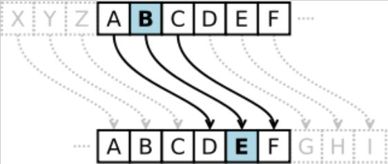
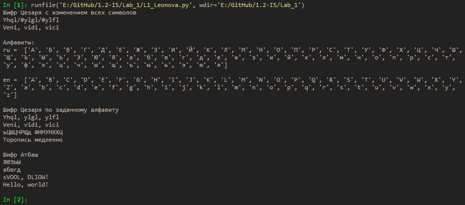

---
## Front matter
lang: ru-RU
title: |
    Отчёт по лабораторной работе №1.  
    Шифры простой замены
author: |
    *Дисциплина: Математические основы защиты информации*  
    *и информационной безопасности*  
    \vspace{2pt}  
    **Студент:** Леонова Алина Дмитриевна, 1032212306  
		**Группа:** НФИмд-01-21  
		**Преподаватель:** д-р.ф.-м.н., проф. Кулябов Дмитрий Сергеевич  
    \vspace{2pt}
date: 14 ноября, 2021, Москва

## Formatting
toc: false
slide_level: 2
theme: metropolis
header-includes:
 - \metroset{progressbar=frametitle,sectionpage=progressbar,numbering=fraction}
 - '\makeatletter'
 - '\beamer@ignorenonframefalse'
 - '\makeatother'
aspectratio: 43
section-titles: true
linestretch: 1.25

mainfont: PT Serif
romanfont: PT Serif
sansfont: PT Sans
monofont: PT Mono
mainfontoptions: Ligatures=TeX
romanfontoptions: Ligatures=TeX
sansfontoptions: Ligatures=TeX,Scale=MatchLowercase
monofontoptions: Scale=MatchLowercase,Scale=0.7
---

## Цель работы
Целью данной работы является ознакомление с двумя шифрами простой замены: шифром Цезаря и шифром Атбаш, кроме того, их реализация на языке выбранном программирования. 

## Задание

1. Реализовать шифр Цезаря с произвольным ключом k.
2. Реализовать шифр Атбаш.

# Теоретическое введение

## Шифр Цезаря

Kаждый символ открытого текста заменяется на некоторый, фиксированный при данном ключе символ того же алфавита.

{#fig:001 width=35%}

В шифре Цезаря ключом служит произвольное целое число k. Каждая буква открытого текста заменяется буквой, стоящей на k знаков дальше нее в алфавите. К примеру, пусть ключом будет число 3 (см. рис. [-@fig:001]).

## Шифр Цезаря
Если сопоставить каждому символу алфавита его порядковый номер (нумеруя с 0), то шифрование и дешифрование можно выразить следующими формулами:
$$ y = (x + k) \;mod \;m $$ 
$$ x = (y - k) \;mod \;m $$
где $x$ — символ открытого текста, $y$ — символ шифрованного текста, $m$ — мощность алфавита, а $k$ — ключ, $mod$ - операция нахождения остатка от деления.

## Шифр Атбаш.
{#fig:002 width=100%}

Правило шифрования состоит в замене $i$-й буквы алфавита на $i$-ю букву алфавита с конца, букву с номером $n-i+1$, где $n$ — число букв в алфавите (см. рис. [-@fig:002]).

# Выполнение лабораторной работы
## Реализация шифра Цезаря с произвольным ключом k
```python
print('Шифр Цезаря с изменением всех символов')

def Cesar0(text, k):
    res = ''
    for i in text:
        e = ord(i) + k
        res += chr(e)
    return res
```
## Реализация шифра Цезаря с произвольным ключом k
```python
def de_Cesar0(text, k):
    res = ''
    for i in text:
        e = ord(i) - k
        res += chr(e)
    return res

k = 3
r = Cesar0('Veni, vidi, vici',k)
print(r)
print(de_Cesar0(r,k))
```

## Алфавиты
```python
# алфавиты
print('\nАлфавиты:')
ru = [chr(i) for i in range ( ord('А'), ord('я') + 1)]
en = [chr(i) for i in range ( ord('A'), ord('Z') + 1)] \
     + [chr(i) for i in range ( ord('a'), ord('z') + 1)]
print('ru = ',ru)
print('\nen = ',en)
```

## Реализация шифра Цезаря с произвольным ключом k
```python
# по заданному алфавиту
print('\nШифр Цезаря по заданному алфавиту')

def Cesar(text, k, abc):
    res = ''
    for i in text:
        if i in abc:
            n = abc.index(i)
            e = (n+k) % len(abc)
            res += abc[e]
        else:
            res += i
    return res
```
## Реализация шифра Цезаря с произвольным ключом k
```python
def de_Cesar(text, k, abc):
    res = ''
    for i in text:
        if i in abc:
            n = abc.index(i)
            e = (n-k) % len(abc)
            res += abc[e]
        else:
            res += i
    return res
```
## Реализация шифра Цезаря с произвольным ключом k
```python
k = 3
r = Cesar('Veni, vidi, vici', k, en)
print(r)
print(de_Cesar(r, k, en))
k = 1000
r = Cesar('Торопись медленно', k, ru)
print(r)
print(de_Cesar(r, k, ru))
```

## Реализация шифра Атбаш
```python
# 2. Реализовать шифр Атбаш
print('\nШифр Атбаш')

def Atbash(text, abc):
    res = ''
    for i in text:
        if i in abc:
            e = abc.index(i)
            res += abc[-e-1]
        else:
            res += i
    return res
```
## Реализация шифра Атбаш
```python
r = Atbash('абвгд', ru)
print(r)
print(Atbash(r,ru))
r = Atbash('Hello, world!', en)
print(r)
print(Atbash(r,en))
```

## Результаты
{#fig:003 width=100%}

## Выводы
Цель лабораторной работы была достигнута, два шифра простой замены, шифр Цезаря и шифр Атбаш, были реализованы на языке программирования Python.