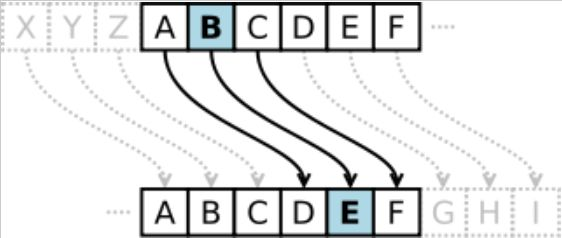
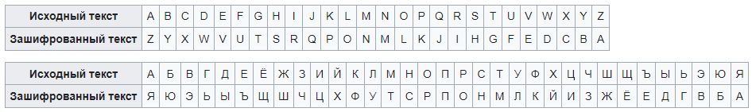
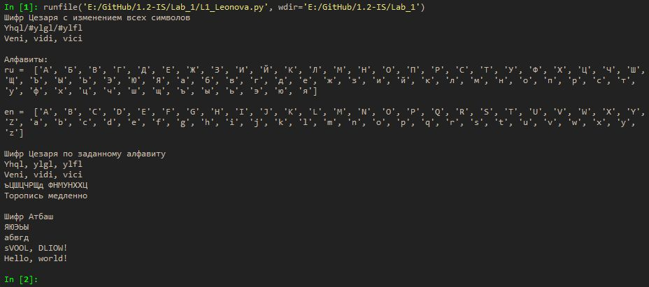

---
# Титульный лист
title: |
    Отчёт по лабораторной работе №1             
    Шифры простой замены                          
author:
- "Студент: Леонова Алина Дмитриевна, 1032212306"
- "Группа: НФИмд-01-21"
- "Преподаватель: Кулябов Дмитрий Сергеевич,"
- "д-р.ф.-м.н., проф."
date: "Москва 2021"

# Общие опции
lang: ru-RU
toc-title: "Содержание"

# Библиография
bibliography: bib/cite.bib
csl: pandoc/csl/gost-r-7-0-5-2008-numeric.csl

# Конвертация в ПДФ
toc: true # Содержание
toc_depth: 2
lof: true # Список изображений
lot: true # Список таблиц
fontsize: 12pt
linestretch: 1.5
papersize: a4
documentclass: scrreprt

## I18n
polyglossia-lang:
  name: russian
  options:
	- spelling=modern
	- babelshorthands=true
polyglossia-otherlangs:
  name: english
### Шрифты
mainfont: PT Serif
romanfont: PT Serif
sansfont: PT Sans
monofont: PT Mono
mainfontoptions: Ligatures=TeX
romanfontoptions: Ligatures=TeX
sansfontoptions: Ligatures=TeX,Scale=MatchLowercase
monofontoptions: Scale=MatchLowercase,Scale=0.8
## Biblatex
biblatex: true
biblio-style: "gost-numeric"
biblatexoptions:
  - parentracker=true
  - backend=biber
  - hyperref=auto
  - language=auto
  - autolang=other*
  - citestyle=gost-numeric

## Misc options
indent: true
header-includes:
  - \linepenalty=10 # the penalty added to the badness of each line within a paragraph (no associated penalty node) Increasing the value makes tex try to have fewer lines in the paragraph.
  - \interlinepenalty=0 # value of the penalty (node) added after each line of a paragraph.
  - \hyphenpenalty=50 # the penalty for line breaking at an automatically inserted hyphen
  - \exhyphenpenalty=50 # the penalty for line breaking at an explicit hyphen
  - \binoppenalty=700 # the penalty for breaking a line at a binary operator
  - \relpenalty=500 # the penalty for breaking a line at a relation
  - \clubpenalty=150 # extra penalty for breaking after first line of a paragraph
  - \widowpenalty=150 # extra penalty for breaking before last line of a paragraph
  - \displaywidowpenalty=50 # extra penalty for breaking before last line before a display math
  - \brokenpenalty=100 # extra penalty for page breaking after a hyphenated line
  - \predisplaypenalty=10000 # penalty for breaking before a display
  - \postdisplaypenalty=0 # penalty for breaking after a display
  - \floatingpenalty = 20000 # penalty for splitting an insertion (can only be split footnote in standard LaTeX)
  - \raggedbottom # or \flushbottom
  - \usepackage{float} # keep figures where there are in the text
  - \floatplacement{figure}{H} # keep figures where there are in the text

  - \usepackage{titling}
  - \setlength{\droptitle}{-9em}
  - \pretitle{\begin{center}
      \textbf{РОССИЙСКИЙ УНИВЕРСИТЕТ ДРУЖБЫ НАРОДОВ}\\
      \textbf{Факультет физико-математических и естественных наук}\\
      \textbf{Кафедра прикладной информатики и теории вероятностей}
      \vspace{9cm}
      \LARGE\\}
  - \posttitle{\vskip 1em \Large \emph{\textit{Дисциплина$:$ Математические основы защиты информации и информационной безопасности}} \end{center}}    
  - \preauthor{\vskip 3em \begin{flushright} \large \begin{tabular}[t]{c}}
  - \postauthor{\end{tabular}\par\end{flushright} \vfill \vskip 5em}
---

# Цель работы
Целью данной работы является ознакомление с двумя шифрами простой замены: шифром Цезаря и шифром Атбаш, кроме того, их реализация на языке выбранном программирования. 

# Задание

1. Реализовать шифр Цезаря с произвольным ключом k.
2. Реализовать шифр Атбаш.

# Теоретическое введение

## Шифр Цезаря

Шифр Цезаря относится к группе одноалфавитных шифров подстановки. При использовании шифров этой группы каждый символ открытого текста заменяется на некоторый, фиксированный при данном ключе символ того же алфавита [@habr].

{#fig:001 width=50%}

В шифре Цезаря ключом служит произвольное целое число k. Каждая буква открытого текста заменяется буквой, стоящей на k знаков дальше нее в алфавите. К примеру, пусть ключом будет число 3. Тогда буква A английского алфавита будет заменена буквой D, буква B — буквой E и так далее (см. рис. [-@fig:001]).

Если сопоставить каждому символу алфавита его порядковый номер (нумеруя с 0), то шифрование и дешифрование можно выразить следующими формулами:
$$ y = (x + k) \;mod \;m $$ 
$$ x = (y - k) \;mod \;m $$
где $x$ — символ открытого текста, $y$ — символ шифрованного текста, $m$ — мощность алфавита, а $k$ — ключ, $mod$ - операция нахождения остатка от деления [@wiki:cesar].


## Шифр Атбаш.

{#fig:002 width=100%}

Правило шифрования состоит в замене $i$-й буквы алфавита на $i$-ю букву алфавита с конца, букву с номером $n-i+1$, где $n$ — число букв в алфавите (см. рис. [-@fig:002]) [@wiki:atbash].

# Выполнение лабораторной работы
## Реализация шифра Цезаря с произвольным ключом k
Поскольку в задании алфавит для шифрования не был задан, сперва реализую вариант шифра Цезаря для всех unicode символов. Функция Cesar0 для шифрования и de_Cesar0 для дешифрования текста со сдвигом k.
```python
# 1. Реализовать шифр Цезаря с произвольным ключом k

# с изменением всех символов
print('Шифр Цезаря с изменением всех символов')

def Cesar0(text, k):
    res = ''
    for i in text:
        e = ord(i) + k
        res += chr(e)
    return res

def de_Cesar0(text, k):
    res = ''
    for i in text:
        e = ord(i) - k
        res += chr(e)
    return res

k = 3
r = Cesar0('Veni, vidi, vici',k)
print(r)
print(de_Cesar0(r,k))
```

Но обычно принято рассматривать алфавит в пределах какого-то конкретного языка, поэтому далее я создаю списки букв, составляющих кириллицу (ru) и латиницу (en), сначала все заглавные бугвы, потом все строчные.
```python
# алфавиты
print('\nАлфавиты:')
ru = [chr(i) for i in range ( ord('А'), ord('я') + 1)]
en = [chr(i) for i in range ( ord('A'), ord('Z') + 1)] \
     + [chr(i) for i in range ( ord('a'), ord('z') + 1)]
print('ru = ',ru)
print('\nen = ',en)
```

Теперь создаю функции Cesar и de_Cesar для шифрования и дешифрования текста шифром Цезаря на заданном алфавите (ru или en) со сдвигом k. В таком случае все символы, не входящие в алфавит, не будут изменяться при шифровании. А также число k может превосходить размер алфавита и шифрование всегда будет производиться символами, входящими в алфавит.
```python
# по заданному алфавиту
print('\nШифр Цезаря по заданному алфавиту')

def Cesar(text, k, abc):
    res = ''
    for i in text:
        if i in abc:
            n = abc.index(i)
            e = (n+k) % len(abc)
            res += abc[e]
        else:
            res += i
    return res

def de_Cesar(text, k, abc):
    res = ''
    for i in text:
        if i in abc:
            n = abc.index(i)
            e = (n-k) % len(abc)
            res += abc[e]
        else:
            res += i
    return res

k = 3
r = Cesar('Veni, vidi, vici', k, en)
print(r)
print(de_Cesar(r, k, en))
k = 1000
r = Cesar('Торопись медленно', k, ru)
print(r)
print(de_Cesar(r, k, ru))
```

## Реализация шифра Атбаш

Шифрования и дешифрования текста шифром Атбаш на заданном алфавите (ru или en) реализовано функцией Atbash. Все символы, не входящие в алфавит, не будут изменяться при шифровании.
```python
# 2. Реализовать шифр Атбаш
print('\nШифр Атбаш')

def Atbash(text, abc):
    res = ''
    for i in text:
        if i in abc:
            e = abc.index(i)
            res += abc[-e-1]
        else:
            res += i
    return res

r = Atbash('абвгд', ru)
print(r)
print(Atbash(r,ru))
r = Atbash('Hello, world!', en)
print(r)
print(Atbash(r,en))
```

{#fig:003 width=100%}

Реализованные функции шифрования и дешифрования шифрами Цезаря и Атбаш были проверены для английского и русского языка (латиницы и кириллицы) на нескольких примерах из задания к лаборатоной работе (см. рис. [-@fig:003]).


# Выводы
Цель лабораторной работы была достигнута, два шифра простой замены, шифр Цезаря и шифр Атбаш, были реализованы на языке программирования Python. 

# Список литературы{.unnumbered}

::: {#refs}
:::
