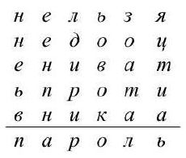
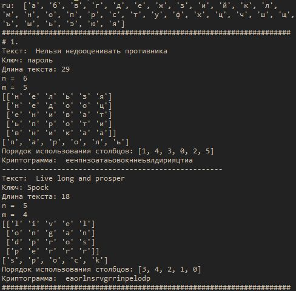
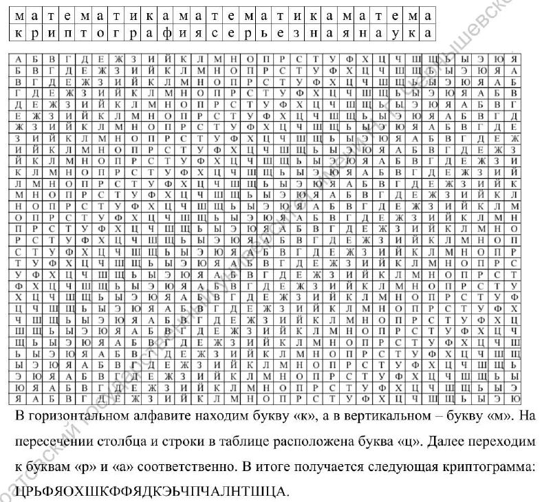
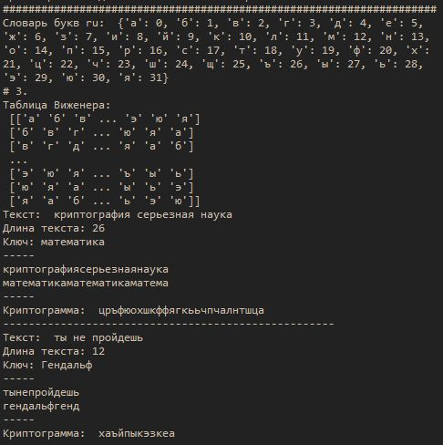

---
## Front matter
lang: ru-RU
title: |
    Отчёт по лабораторной работе №2.  
    Шифры перестановки
author: |
    *Дисциплина: Математические основы защиты информации*  
    *и информационной безопасности*  
    \vspace{2pt}  
    **Студент:** Леонова Алина Дмитриевна, 1032212306  
		**Группа:** НФИмд-01-21  
		**Преподаватель:** д-р.ф.-м.н., проф. Кулябов Дмитрий Сергеевич  
    \vspace{2pt}
date: 20 ноября, 2021, Москва

## Formatting
toc: false
slide_level: 2
theme: metropolis
header-includes:
 - \metroset{progressbar=frametitle,sectionpage=progressbar,numbering=fraction}
 - '\makeatletter'
 - '\beamer@ignorenonframefalse'
 - '\makeatother'
aspectratio: 43
section-titles: true
linestretch: 1.25

mainfont: PT Serif
romanfont: PT Serif
sansfont: PT Sans
monofont: PT Mono
mainfontoptions: Ligatures=TeX
romanfontoptions: Ligatures=TeX
sansfontoptions: Ligatures=TeX,Scale=MatchLowercase
monofontoptions: Scale=MatchLowercase,Scale=0.7
---

## Цель работы

Целью данной работы является ознакомление с шифрами перестановки и их реализация на выбранном языке программирования. 

## Задание

Реализовать все рассмотренные шифры программно.

## Теоретическое введение (промежуточная страница)

Шифры перестановки преобразуют открытый текст в криптограмму путем перестановки его символов. Способ, каким при шифровании переставляются буквы открытого текста, и является ключем шифра.

## Маршрутное шифрование

{#fig:001 width=20%}

Текст разбивается на блоки равной длины, блоки записываются в виде таблицы, недостающие символы дополняются. Создается ключ-строка, в которой все символы различны. В алфавитном порядке символов ключа выписываются столбцы таблицы.

## Маршрутное шифрование

{#fig:002 width=50%}

## Маршрутное шифрование

{#fig:003 width=80%}

## Шифрование с помощью решеток

Строка дополняется произвольными одинаковыми символами так, чтобы её длина была квадратом целого четного числа. Взяв корень из длины строки получаем размерность маленького квадрата $k$. Путем поворота его на 90 градусов вправо и присоединения к исходному квадрату справа получим больший квадрат размерности $2k$.

## Шифрование с помощью решеток

Теперь из большого квадрата мы случайным образом удаляем $k$ различных чисел, чтобы получить своего рода "решето". С помощью решета получаем таблицу с символами, а затем применяем маршрутное шифрование (см. рис. [-@fig:002]).

## Шифрование с помощью решеток

{#fig:004 width=75%}

## Шифрование таблицей Виженера

{#fig:005 width = 90%}

## Шифрование таблицей Виженера

Создадим таблицу Виженера - таблицу, в начале строки и столбца которой находятся все возможные буквы выбранного алфавита (см. рис. [-@fig:006]).

Ключ повторяется до тех пор, пока его длина не станет равна длине сообщения. На пересечении $i$тых координат сообщения и ключа по таблице получается символ.

## Результат работы шифрования Виженера
{#fig:006 width=90%}

## Выводы
Цель лабораторной работы была достигнута, три данные шифра перестановки были изучены и реализованы на языке программирования Python. 