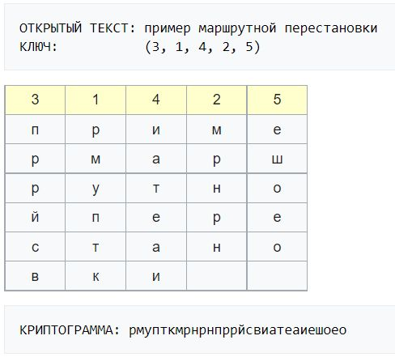
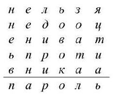
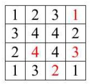
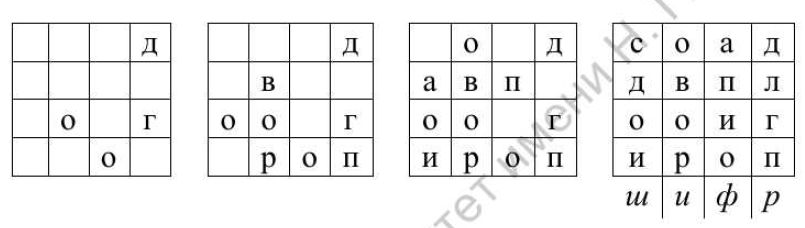
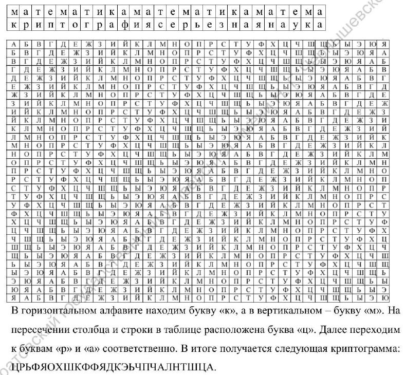
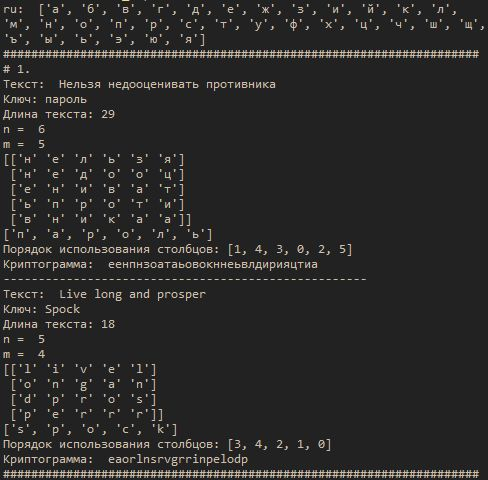
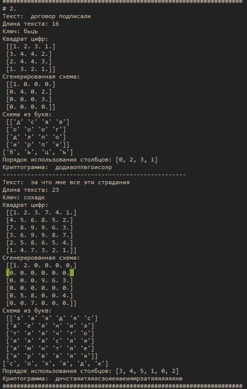
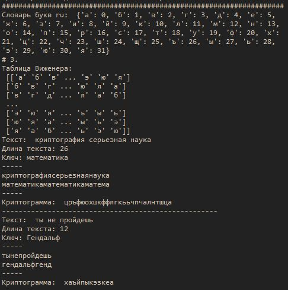

---
# Титульный лист
title: |
    Отчёт по лабораторной работе №2             
    Шифры перестановки                          
author:
- "Студент: Леонова Алина Дмитриевна, 1032212306"
- "Группа: НФИмд-01-21"
- "Преподаватель: Кулябов Дмитрий Сергеевич,"
- "д-р.ф.-м.н., проф."
date: "Москва 2021"

# Общие опции
lang: ru-RU
toc-title: "Содержание"

# Библиография
bibliography: bib/cite.bib
csl: pandoc/csl/gost-r-7-0-5-2008-numeric.csl

# Конвертация в ПДФ
toc: true # Содержание
toc_depth: 2
lof: true # Список изображений
lot: true # Список таблиц
fontsize: 12pt
linestretch: 1.5
papersize: a4
documentclass: scrreprt

## I18n
polyglossia-lang:
  name: russian
  options:
	- spelling=modern
	- babelshorthands=true
polyglossia-otherlangs:
  name: english
### Шрифты
mainfont: PT Serif
romanfont: PT Serif
sansfont: PT Sans
monofont: PT Mono
mainfontoptions: Ligatures=TeX
romanfontoptions: Ligatures=TeX
sansfontoptions: Ligatures=TeX,Scale=MatchLowercase
monofontoptions: Scale=MatchLowercase,Scale=0.8
## Biblatex
biblatex: true
biblio-style: "gost-numeric"
biblatexoptions:
  - parentracker=true
  - backend=biber
  - hyperref=auto
  - language=auto
  - autolang=other*
  - citestyle=gost-numeric

## Misc options
indent: true
header-includes:
  - \linepenalty=10 # the penalty added to the badness of each line within a paragraph (no associated penalty node) Increasing the value makes tex try to have fewer lines in the paragraph.
  - \interlinepenalty=0 # value of the penalty (node) added after each line of a paragraph.
  - \hyphenpenalty=50 # the penalty for line breaking at an automatically inserted hyphen
  - \exhyphenpenalty=50 # the penalty for line breaking at an explicit hyphen
  - \binoppenalty=700 # the penalty for breaking a line at a binary operator
  - \relpenalty=500 # the penalty for breaking a line at a relation
  - \clubpenalty=150 # extra penalty for breaking after first line of a paragraph
  - \widowpenalty=150 # extra penalty for breaking before last line of a paragraph
  - \displaywidowpenalty=50 # extra penalty for breaking before last line before a display math
  - \brokenpenalty=100 # extra penalty for page breaking after a hyphenated line
  - \predisplaypenalty=10000 # penalty for breaking before a display
  - \postdisplaypenalty=0 # penalty for breaking after a display
  - \floatingpenalty = 20000 # penalty for splitting an insertion (can only be split footnote in standard LaTeX)
  - \raggedbottom # or \flushbottom
  - \usepackage{float} # keep figures where there are in the text
  - \floatplacement{figure}{H} # keep figures where there are in the text

  - \usepackage{titling}
  - \setlength{\droptitle}{-9em}
  - \pretitle{\begin{center}
      \textbf{РОССИЙСКИЙ УНИВЕРСИТЕТ ДРУЖБЫ НАРОДОВ}\\
      \textbf{Факультет физико-математических и естественных наук}\\
      \textbf{Кафедра прикладной информатики и теории вероятностей}
      \vspace{9cm}
      \LARGE\\}
  - \posttitle{\vskip 1em \Large \emph{\textit{Дисциплина$:$ Математические основы защиты информации и информационной безопасности}} \end{center}}    
  - \preauthor{\vskip 3em \begin{flushright} \large \begin{tabular}[t]{c}}
  - \postauthor{\end{tabular}\par\end{flushright} \vfill \vskip 5em}
---

# Цель работы

Целью данной работы является ознакомление с шифрами перестановки и их реализация на выбранном языке программирования. 

# Задание

Реализовать все рассмотренные шифры программно.

# Теоретическое введение

Шифры перестановки преобразуют открытый текст в криптограмму путем перестановки его символов. Способ, каким при шифровании переставляются буквы открытого текста, и является ключем шифра.

## 1. Маршрутное шифрование (Маршрутная перестановка)

Маршрутная перестановка — это шифр вертикальной перестановки, метод симметричного шифрования, в котором элементы исходного открытого текста меняют местами [@wiki1].

{#fig:001 width=90%}

{#fig:002 width=30%}

В этом шифре также используется прямоугольная таблица, в которую сообщение записывается по строкам слева направо. Выписывается шифрограмма по вертикалям, при этом столбцы выбираются в порядке, определяемом ключом (см. рис. [-@fig:001]). Также возможна вариация, когда ключём служит пароль и есть договорённость как его использовать, например, в алфпвитном порядке (см. рис. [-@fig:002]).

## 2. Шифрование с помощью решеток

Выбирается натуральное число k > 1, и квадрат размерности k×k построчно заполняется числами 1, 2, ..., k. Для примера возьмем k = 2. 

{#fig:003 width=30%}

Квадрат поворачивается по часовой стрелке на 90° и размещается вплотную к предыдущему квадрату. Аналогичные действия совершаются еще два раза, так чтобы в результате из четырех малых квадратов образовался один большой с длиной стороны 2k (см. рис. [-@fig:003]).

{#fig:004 width=100%}

Далее из большого квадрата вырезаются клетки с числами от 1 до k2, для каждого числа одна клетка. Процесс шифрования происходит следующим образом. Сделанная решетка (квадрат с прорезями) накладывается на чистый квадрат 2k×2k и в прорези по строчкам (т.е. слева направо и сверху вниз) вписываются первые буквы открытого текста. Затем решетка поворачивается на 90° по часовой стрелке и накладывается на частично заполненный квадрат, вписывание продолжается.

После третьего поворота, наложения и вписывания все клетки квадрата будут заполнены. Например, с использованием изображенной выше решетки и пароля ш и ф р открытый текст договор подписали переводится в криптограмму за пять шагов, итоговая криптограмма: ОВОРДЛГПАПИОСДОИ (см. рис. [-@fig:004]) [@q2].

## 3. Таблица Виженера 

Шифр Виженера  — метод полиалфавитного шифрования буквенного текста с использованием ключевого слова. Этот метод является простой формой многоалфавитной замены [@wiki2].

{#fig:005 width=90%}

Пароль записывается с повторениями пока не поровняется по длине с текстом, который требуется зашифровать. Для шифрования и дешифрования используется таблица Виженера, она содержит все возможные смещения интересующего алфавита (см. рис. [-@fig:005]).


# Выполнение лабораторной работы
## 0. Импортирование библиотек и промежуточные функции

Для первого и второго шифров в конце требцется делать одно и то же действие:
```python
import numpy as np
import math

def grid_reading(key, table):
    _key = sorted(key)
    order = [key.index(i) for i in _key]
    print(list(key))
    #print(_key)
    print('Порядок использования столбцов:', order)
    m = table.shape[0]
    res = ''
    for j in order:
        for i in range(m):
            res += table[i][j]
    return res

ru = [chr(i) for i in range(ord('а'), ord('я')+1)]
print('ru: ',ru)
```

## 1. Маршрутное шифрование (Маршрутная перестановка)
```python
print('####################################################################')
# 1. Маршрутное шифрование
print('# 1.')
def task1_rout(text, key):
    print('Текст: ', text)
    text = text.replace(' ','').lower()
     
    print('Ключ:', key)
    key = key.lower()
    
    n = len(key)
    t_len = len(text)
    m = math.ceil(t_len/n)
    A = np.full((m,n),'')
    print('Длина текста:', t_len)
    print('n = ', n, '\nm = ', m)
    
    for k in range(n*m - t_len):
        text += text[-1]
    #print(text)
    
    k = 0
    for i in range(m):
        for j in range(n):
            A[i][j] = text[k]
            k += 1
    print(A)
    
    res = grid_reading(key, A)
    
    print('Криптограмма: ', res)
    

text = 'Нельзя недооценивать противника'
key = 'пароль'
task1_rout(text, key)

print('----------------------------------------------------')
text = 'Live long and prosper'
key = 'Spock'
task1_rout(text, key)
```
{#fig:006 width=100%}

Результат выполнения этого фрагмента кода, реализации маршрутного шифрования и проверкой (см. рис. [-@fig:006]).


## 2. Шифрование с помощью решеток
```python
print('####################################################################')
# 2. Шифрование с помощью решеток

def rotate_90r(A):
    x = A.shape[0]
    y = A.shape[1]
    res = np.empty((y,x))
    for i in range(x):
        for j in range(y):
            res[j, x-1-i] = A[i,j]
    return res
    
def generate_key(lenth):
    key = ''
    while (len(key) != lenth):
        _key = np.random.randint(len(ru))
        if (key.count(ru[_key]) == 0):
            key += ru[_key]
    return key


print('# 2.')
def task2_grid(text):
    print('Текст: ', text)
    text = text.replace(' ','').lower()
    
    t_len = len(text)
    print('Длина текста:', t_len)
       
    size = math.ceil(np.sqrt(t_len))    # количество чисел в маленькой таблице
    while size % np.sqrt(size) != 0:
        size += 1
    
    for k in range(size*size - t_len):
        text += text[-1]
    
    t_s = int(np.sqrt(size))    # размер малькой таблицы
    t_s2 = t_s * 2      # размер большой таблицы
    t_el = np.arange(1,size+1)     # массив значений size
    
    key = generate_key(t_s2)    
    #key = 'шифр'
    print('Ключ:', key)
    key = key.lower()
    
    
    A0 = np.empty((t_s,t_s)) 
    n = 0
    for i in range(t_s):
        for j in range(t_s):
            A0[i][j] = t_el[n]
            n += 1
        
    A1 = np.concatenate((A0,rotate_90r(A0)),axis=1)
    A2 = np.concatenate((A1,rotate_90r(rotate_90r(A1))),axis=0)  
    #print(A0)
    #print(A1)
    print('Квадрат цифр:\n', A2)
     
    R = np.zeros((t_s2,t_s2))
    tmp = t_el.copy()
    for k in range (size):
        r = np.random.randint(4)
        tmp_count = 0
        for i in range (t_s2):
            for j in range (t_s2):
                if (A2[i][j] == k + 1):
                    if(tmp_count == r):
                        R[i][j] = A2[i][j]
                        tmp_count = -100
                        tmp = tmp[tmp != k+1]
                    else:
                        tmp_count += 1
    print('Сгенерированная схема:\n', R)
    
    n = 0
    answer = np.full((t_s2, t_s2),'')
    
    for k in range(4):
        for i in range(t_s2):
            for j in range(t_s2):
                if(R[i][j] != 0):
                    answer[i][j] = text[n]
                    n += 1
        #print(k)
        #print(R)
        #print(answer)
        R = rotate_90r(R)
        
    print('Схема из букв:\n', answer)
    
    res = grid_reading(key, answer)
    print('Криптограмма: ', res)


text = 'договор подписали'
task2_grid(text)

print('----------------------------------------------------')

text = 'за что мне все эти страдания'
task2_grid(text)
```

{#fig:007 width=100%}

Результат выполнения этого фрагмента кода, реализации шифрования с помощью решеток с проверкой (см. рис. [-@fig:007]).


## 3. Таблица Виженера 
```python
print('####################################################################')
letters = {ru[i]:i for i in range(len(ru))}
print('Словарь букв ru: ', letters)

# 3. Таблица Виженера
print('# 3.')

vigenere_table = np.array(ru)
for i in range(1, len(ru)):
    row = np.roll(ru, -i)
    vigenere_table = np.vstack((vigenere_table, row))
print('Таблица Виженера: \n',vigenere_table)

def task3_vigenere(text, key):
    print('Текст: ', text)
    text = text.replace(' ','').lower()
    
    t_len = len(text)
    print('Длина текста:', t_len)
    
    print('Ключ:', key)
    key = key.lower()
    
    n = len(key)
    _key = key
    
    while len(_key) < t_len:
        _key += _key[len(_key) - n]
    print('-----')
    print(text)
    print(_key)
    print('-----')
    
    res = ''
    for i in range(t_len):
        x = letters[_key[i]]    # номера букв ключа
        y = letters[text[i]]    # номера букв текста
        
        res += vigenere_table[x][y]
    print('Криптограмма: ', res)


text = 'криптография серьезная наука'
key = 'математика'
task3_vigenere(text, key)

print('----------------------------------------------------')
text = 'ты не пройдешь'
key = 'Гендальф'
task3_vigenere(text, key)
```

{#fig:008 width=100%}

Результат выполнения этого фрагмента кода, реализации использования таблицы Виженера с проверкой (см. рис. [-@fig:008]).


# Выводы
Цель лабораторной работы была достигнута, три данные шифра перестановки были изучены и реализованы на языке программирования Python. 

# Список литературы{.unnumbered}

::: {#refs}
:::
