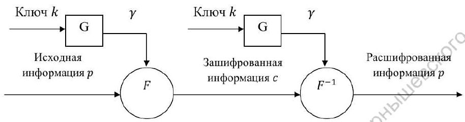

---
## Front matter
lang: ru-RU
title: |
    Отчёт по лабораторной работе №3.  
    Шифрование гаммированием
author: |
    *Дисциплина: Математические основы защиты информации*  
    *и информационной безопасности*  
    \vspace{2pt}  
    **Студент:** Леонова Алина Дмитриевна, 1032212306  
		**Группа:** НФИмд-01-21                                         
		**Преподаватель:** д-р.ф.-м.н., проф. Кулябов Дмитрий Сергеевич  
    \vspace{2pt}
date: 27 ноября, 2021, Москва

## Formatting
toc: false
slide_level: 2
theme: metropolis
header-includes:
 - \metroset{progressbar=frametitle,sectionpage=progressbar,numbering=fraction}
 - '\makeatletter'
 - '\beamer@ignorenonframefalse'
 - '\makeatother'
aspectratio: 43
section-titles: true
linestretch: 1.25

mainfont: PT Serif
romanfont: PT Serif
sansfont: PT Sans
monofont: PT Mono
mainfontoptions: Ligatures=TeX
romanfontoptions: Ligatures=TeX
sansfontoptions: Ligatures=TeX,Scale=MatchLowercase
monofontoptions: Scale=MatchLowercase,Scale=0.7
---

## Цель и задание работы

\textbf{Цель работы}

Целью данной работы является ознакомление с шифрованием гаммированием и реализация алгоритма на выбранном языке программирования. 

\textbf{Задание}

Реализовать алгоритм шифрования гаммированием конечной гаммой программно.

# Теоретическое введение

## Шифрование гаммированием

Гаммирование, наложение гаммы или Шифр XOR ( $\oplus$ ), -- метод симметричного шифрования, заключающийся в наложении последовательности, состоящей из случайных чисел, на открытый текст.

Последовательность случайных чисел называется гамма-последовательностью и используется для зашифровывания и расшифровывания данных. 

Суммирование обычно выполняется в каком-либо конечном поле. Например, суммирование может принимать вид операции исключающее ИЛИ / XOR / $\oplus$ .

## Шифрование гаммированием

{#fig:001 width=100%}

В качестве ключа используются либо истинно случайные гаммы, либо псевдослучайные гаммы — последовательности чисел, вычисленные по определённому алгоритму (рис. [-@fig:001]).

## Сложение по модулю 2

Символы текста и гаммы представляются в двоичном виде, а затем каждая пара двоичных разрядов складывается по модулю 2:

$C_i = P_i \oplus K_i$

$P_i = C_i \oplus K_i$

где $P_i$, $C_i$ -- i-ый символ открытого и шифрованного сообщения;

$K_i$ -- i-ый символ гаммы (ключа).

## Сложение по модулю N

При замене букв исходного сообщения и ключа на числа в рамках определённого алфавита процедуры шифрования и дешифрования выполняются по следующим формулам:

$C_i = (P_i + K_i) \;mod \;N$

$P_i = (C_i + N - K_i) \;mod \;N$

где $P_i$, $C_i$ -- i-ый символ открытого и шифрованного сообщения;

$N$ -- количество символов в алфавите;

$K_i$ -- i-ый символ гаммы (ключа).

# Выполнение работы

## Реализация шифрования гаммированием с конечной гаммой

{#fig:002 width=100%}

## Результат работы шифрования гаммированием с конечной гаммой

{#fig:003 width=50%}

Результат выполнения программы, реализации шифрования гаммированием с конечной гаммой, проверка на примере из задания и произвольном (см. рис. [-@fig:003]).

## Выводы

Цель лабораторной работы была достигнута, алгоритм шифрования гаммированием с конечной гаммой был реализован на языке программирования Python. 