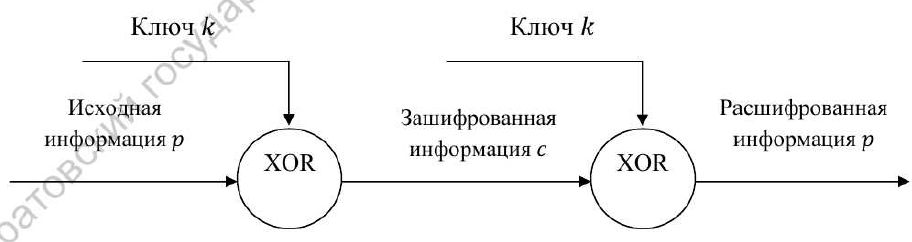
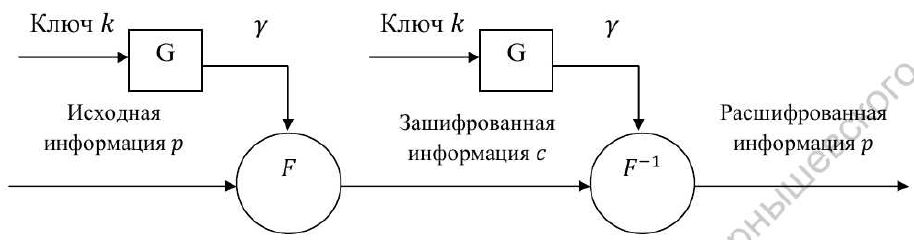
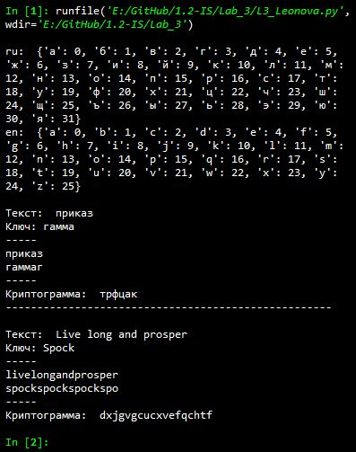

---
# Титульный лист
title: |
    Отчёт по лабораторной работе №3             
    Шифрование гаммированием                          
author:
- "Студент: Леонова Алина Дмитриевна, 1032212306"
- "Группа: НФИмд-01-21"
- "Преподаватель: Кулябов Дмитрий Сергеевич,"
- "д-р.ф.-м.н., проф."
date: "Москва 2021"

# Общие опции
lang: ru-RU
toc-title: "Содержание"

# Библиография
bibliography: bib/cite.bib
csl: pandoc/csl/gost-r-7-0-5-2008-numeric.csl

# Конвертация в ПДФ
toc: true # Содержание
toc_depth: 2
lof: true # Список изображений
lot: false # Список таблиц
fontsize: 12pt
linestretch: 1.5
papersize: a4
documentclass: scrreprt

## I18n
polyglossia-lang:
  name: russian
  options:
	- spelling=modern
	- babelshorthands=true
polyglossia-otherlangs:
  name: english
### Шрифты
mainfont: PT Serif
romanfont: PT Serif
sansfont: PT Sans
monofont: PT Mono
mainfontoptions: Ligatures=TeX
romanfontoptions: Ligatures=TeX
sansfontoptions: Ligatures=TeX,Scale=MatchLowercase
monofontoptions: Scale=MatchLowercase,Scale=0.8
## Biblatex
biblatex: true
biblio-style: "gost-numeric"
biblatexoptions:
  - parentracker=true
  - backend=biber
  - hyperref=auto
  - language=auto
  - autolang=other*
  - citestyle=gost-numeric

## Misc options
indent: true
header-includes:
  - \linepenalty=10 # the penalty added to the badness of each line within a paragraph (no associated penalty node) Increasing the value makes tex try to have fewer lines in the paragraph.
  - \interlinepenalty=0 # value of the penalty (node) added after each line of a paragraph.
  - \hyphenpenalty=50 # the penalty for line breaking at an automatically inserted hyphen
  - \exhyphenpenalty=50 # the penalty for line breaking at an explicit hyphen
  - \binoppenalty=700 # the penalty for breaking a line at a binary operator
  - \relpenalty=500 # the penalty for breaking a line at a relation
  - \clubpenalty=150 # extra penalty for breaking after first line of a paragraph
  - \widowpenalty=150 # extra penalty for breaking before last line of a paragraph
  - \displaywidowpenalty=50 # extra penalty for breaking before last line before a display math
  - \brokenpenalty=100 # extra penalty for page breaking after a hyphenated line
  - \predisplaypenalty=10000 # penalty for breaking before a display
  - \postdisplaypenalty=0 # penalty for breaking after a display
  - \floatingpenalty = 20000 # penalty for splitting an insertion (can only be split footnote in standard LaTeX)
  - \raggedbottom # or \flushbottom
  - \usepackage{float} # keep figures where there are in the text
  - \floatplacement{figure}{H} # keep figures where there are in the text

  - \usepackage{titling}
  - \setlength{\droptitle}{-9em}
  - \pretitle{\begin{center}
      \textbf{РОССИЙСКИЙ УНИВЕРСИТЕТ ДРУЖБЫ НАРОДОВ}\\
      \textbf{Факультет физико-математических и естественных наук}\\
      \textbf{Кафедра прикладной информатики и теории вероятностей}
      \vspace{9cm}
      \LARGE\\}
  - \posttitle{\vskip 1em \Large \emph{\textit{Дисциплина$:$ Математические основы защиты информации и информационной безопасности}} \end{center}}    
  - \preauthor{\vskip 3em \begin{flushright} \large \begin{tabular}[t]{c}}
  - \postauthor{\end{tabular}\par\end{flushright} \vfill \vskip 5em}
---

# Цель работы

Целью данной работы является ознакомление с шифрованием гаммированием и реализация алгоритма на выбранном языке программирования. 

# Задание

Реализовать алгоритм шифрования гаммированием конечной гаммой программно.

# Теоретическое введение

Гаммирование, наложение гаммы или Шифр XOR ( $\oplus$ ) -- метод симметричного шифрования, заключающийся в наложении последовательности, состоящей из случайных чисел, на открытый текст.

Последовательность случайных чисел называется гамма-последовательностью и используется для зашифровывания и расшифровывания данных. 

Суммирование обычно выполняется в каком-либо конечном поле. Например, суммирование может принимать вид операции исключающее ИЛИ / XOR / $\oplus$  [@wiki].

## Схема однократного использования

{#fig:001 width=100%}

Классический одноразовый шифровальный блокнот -- большой неповторяющийся случайный набор символов ключа, написанный на листах бумаги, склеенных в блокнот. Шифровальщик при личной встрече снабжался блокнотом, каждая страница которого содержала ключ. Такой же блокнот имелся и у принимающей стороны. Использованные страницы после однократного использования уничтожались [@anis] (см. рис. [-@fig:001]). 

Недостаток метода заключается в равенстве объёма ключевой информации объёму передаваемой информации.

## Гаммы

{#fig:002 width=100%}

Стойкость этих шифров определяется качеством гаммы, которое зависит от длины периода (минимального количества символов, после которого последовательность начинает повторяться) и случайности распределения по периоду [@kripto]. Можно использовать случайные (оцифрованные данные случайных процессов) или псевдослучайные гаммы (вычисленные по определённому алгоритму) (см. рис. [-@fig:002]).

В лабораторной работе будет реализовываться вариант, когда гамма при необходимости увеличивается путём повторения ключа до тех пор, пока его длина не станет равна длине сообщения. 

## Сложение по модулю 2

При равенстве объёма ключевой информации и объёма пеоедаваемого текста cимволы текста и гаммы представляются в двоичном виде, а затем каждая пара двоичных разрядов складывается по модулю 2, это значит, что процедуры шифрования и дешифрования выполняются по следующим формулам:

$C_i = P_i \oplus K_i$

$P_i = C_i \oplus K_i$

где $P_i$, $C_i$ -- i-ый символ открытого и шифрованного сообщения;

$K_i$ -- i-ый символ гаммы (ключа).

## Сложение по модулю N

При замене букв исходного сообщения и ключа на числа в рамках определённого алфавита процедуры шифрования и дешифрования выполняются по следующим формулам:

$C_i = (P_i + K_i) \;mod \;N$

$P_i = (C_i + N - K_i) \;mod \;N$

где $P_i$, $C_i$ -- i-ый символ открытого и шифрованного сообщения;

$N$ -- количество символов в алфавите;

$K_i$ -- i-ый символ гаммы (ключа).


# Выполнение лабораторной работы
## 1. Шифрование гаммированием

Шифрование гаммированием будет реализовано для конкретных алфавитов (русского и английского). Для сопоставления букв с номерами используется словарь, он начинается с 0 (буква а), а в примере с 1, также Юникод-символ 'ё' находится после буквы 'я', и размер алфавита равняется не 33, а 32, потому пример из задания не сходится с полученным результатом ровно на одну букву в каждой позиции.

Заданиие алфавитов и словарей для них:

```python
# Шифрование гаммированием

# Алфавиты
ru = [chr(i) for i in range(ord('а'), ord('я')+1)]
en = [chr(i) for i in range(ord('a'), ord('z')+1)]
#print('ru: ',ru)
#print('en: ',en)

# Словари букв и номеров
dict_ru = {ru[i]:i for i in range(len(ru))}
dict_en = {en[i]:i for i in range(len(en))}
print('\nru: ',dict_ru)
print('en: ',dict_en)
```

Реализация функции шифрования гаммированием, которой на вход подаются: текст для шифрования, ключ иди гамма и используемый алфавит:

```python
def gamma(text, key, abc):
    if abc == ru:
        dict_abc = dict_ru
    else:
        dict_abc = dict_en
    abc_len = len(abc)
    
    print('\nТекст: ', text)
    text = text.replace(' ','').lower()
    t_len = len(text)
    
    print('Ключ:', key)
    key = key.lower()
    k_len = len(key)
    gamma = key
    
    while len(gamma) < t_len:
        gamma += gamma[len(gamma) - k_len]
        
    print('-----')
    print(text)
    print(gamma)
    print('-----')
    
    res = ''
    for i in range(t_len):
        x = dict_abc[gamma[i]]   # номера букв ключа
        y = dict_abc[text[i]]    # номера букв текста
        
        res += abc[(x + y) % abc_len]
    print('Криптограмма: ', res)
```

Задание входных параметров и вызов функции гаммирования с конечной гаммой:

```python
text = 'приказ'
key = 'гамма'
gamma(text, key, ru)

print('----------------------------------------------------')

text = 'Live long and prosper'
key = 'Spock'
gamma(text, key, en)
```

{#fig:003 width=70%}

Результат выполнения программы, реализации шифрования гаммированием с конечной гаммой, проверка на примере из задания и произвольном (см. рис. [-@fig:003]).


# Выводы

Цель лабораторной работы была достигнута, алгоритм шифрования гаммированием с конечной гаммой был реализован на языке программирования Python. 

# Список литературы{.unnumbered}

::: {#refs}
:::
