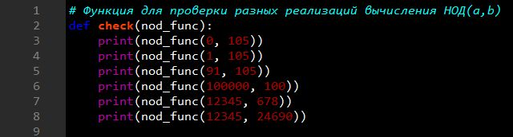
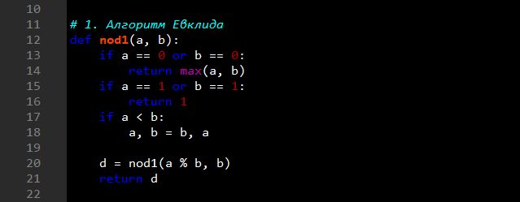
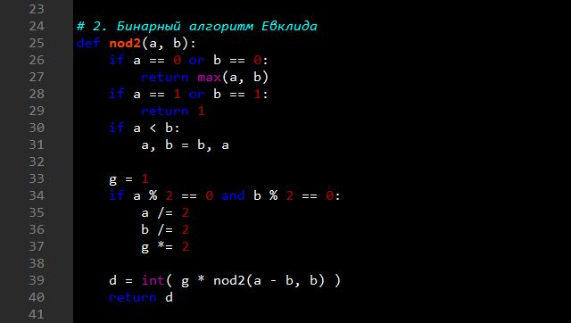
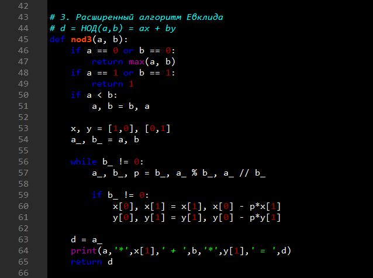
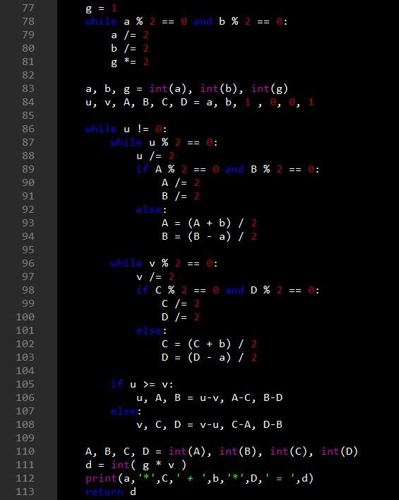
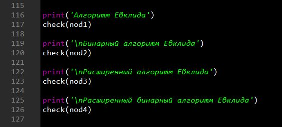
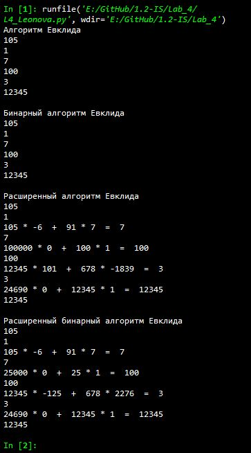

---
## Front matter
lang: ru-RU
title: |
    Отчёт по лабораторной работе №4.  
    Вычисление наибольшего общего делителя
author: |
    *Дисциплина: Математические основы защиты информации*  
    *и информационной безопасности*  
    \vspace{2pt}  
    **Студент:** Леонова Алина Дмитриевна, 1032212306  
		**Группа:** НФИмд-01-21                                         
		**Преподаватель:** д-р.ф.-м.н., проф. Кулябов Дмитрий Сергеевич  
    \vspace{2pt}
date: 4 декабря, 2021, Москва

## Formatting
toc: false
slide_level: 2
theme: metropolis
header-includes:
 - \metroset{progressbar=frametitle,sectionpage=progressbar,numbering=fraction}
 - '\makeatletter'
 - '\beamer@ignorenonframefalse'
 - '\makeatother'
aspectratio: 43
section-titles: true
linestretch: 1.25

mainfont: PT Serif
romanfont: PT Serif
sansfont: PT Sans
monofont: PT Mono
mainfontoptions: Ligatures=TeX
romanfontoptions: Ligatures=TeX
sansfontoptions: Ligatures=TeX,Scale=MatchLowercase
monofontoptions: Scale=MatchLowercase,Scale=0.7
---

## Цель и задание работы

\textbf{Цель работы}

Целью данной работы является ознакомление с четырьмя алгоритмами вычисления наибольшего общего делителя и их реализация на выбранном языке программирования. 

\textbf{Задание}

Реализовать программно алгоритмы вычисления наибольшего общего делителя:

+ алгоритм Евклида
+ бинарный алгоритм Евклида
+ расширенный алгоритм Евклида
+ расширенный бинарный алгоритм Евклида

# Теоретическое введение

## Алгоритм Евклида

+ НОД(A,0) = A
+ НОД(0,B) = B
+ Если A = B*Q + R и B≠0, то НОД(A, B) = НОД(B, R), 

где Q — целое число, а R — целое число от 0 до B-1

## Бинарный алгоритм Евклида

Основан на использовании следующих свойств НОД:

+ НОД(2m, 2n) = 2 НОД(m, n),
+ НОД(2m, 2n+1) = НОД(m, 2n+1),
+ НОД(-m, n) = НОД(m, n)

# Выполнение лабораторной работы

## Функция для проверки

{#fig:001 width=70%}

Функция для проверки функций вычисления НОД(a,b) на 6 парах целых чисел (см. рис. [-@fig:001]).

## Алгоритм Евклида

{#fig:002 width=70%}

Функция, реализующая вычисление НОД(a,b) с помощью алгоритма Евклида (см. рис. [-@fig:002]).

## Бинарный алгоритм Евклида

{#fig:003 width=70%}

Функция, реализующая вычисление НОД(a,b) с помощью бинарного алгоритма Евклида (см. рис. [-@fig:003]).

## Расширенный алгоритм Евклида

{#fig:004 width=60%}

Функция, реализующая вычисление НОД(a,b) с помощью расширенного алгоритма Евклида (см. рис. [-@fig:004]).

## Расширенный бинарный алгоритм Евклида

{#fig:005 width=55%}

## Проверка работы

{#fig:006 width=60%}

Вызов проверок работы всех реализованных функций на шести разных вариантах входных параметров, задаваемых в функции check (см. рис. [-@fig:006]).

## Результат работы реализованных вариаций алгоритма Евклида

{#fig:007 width=35%}

Результат выполнения программы, реализации шифрования гаммированием с конечной гаммой, проверка на примере из задания и произвольном (см. рис. [-@fig:007]).

## Выводы

Цель лабораторной работы была достигнута, четыре алгоритмама вычисления наибольшего общего делителя были реализованы на языке программирования Python.