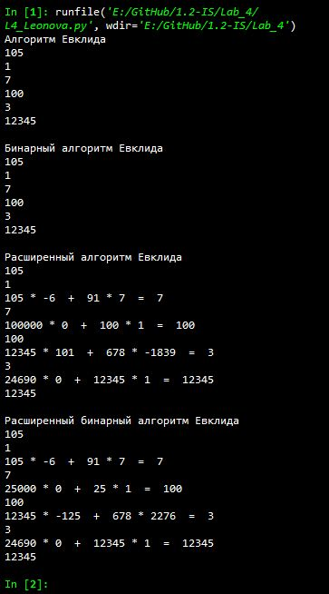

---
# Титульный лист
title: |
    Отчёт по лабораторной работе №4             
    Вычисление наибольшего общего делителя                         
author:
- "Студент: Леонова Алина Дмитриевна, 1032212306"
- "Группа: НФИмд-01-21"
- "Преподаватель: Кулябов Дмитрий Сергеевич,"
- "д-р.ф.-м.н., проф."
date: "Москва 2021"

# Общие опции
lang: ru-RU
toc-title: "Содержание"

# Библиография
bibliography: bib/cite.bib
csl: pandoc/csl/gost-r-7-0-5-2008-numeric.csl

# Конвертация в ПДФ
toc: true # Содержание
toc_depth: 2
lof: true # Список изображений
lot: false # Список таблиц
fontsize: 12pt
linestretch: 1.5
papersize: a4
documentclass: scrreprt

## I18n
polyglossia-lang:
  name: russian
  options:
	- spelling=modern
	- babelshorthands=true
polyglossia-otherlangs:
  name: english
### Шрифты
mainfont: PT Serif
romanfont: PT Serif
sansfont: PT Sans
monofont: PT Mono
mainfontoptions: Ligatures=TeX
romanfontoptions: Ligatures=TeX
sansfontoptions: Ligatures=TeX,Scale=MatchLowercase
monofontoptions: Scale=MatchLowercase,Scale=0.8
## Biblatex
biblatex: true
biblio-style: "gost-numeric"
biblatexoptions:
  - parentracker=true
  - backend=biber
  - hyperref=auto
  - language=auto
  - autolang=other*
  - citestyle=gost-numeric

## Misc options
indent: true
header-includes:
  - \linepenalty=10 # the penalty added to the badness of each line within a paragraph (no associated penalty node) Increasing the value makes tex try to have fewer lines in the paragraph.
  - \interlinepenalty=0 # value of the penalty (node) added after each line of a paragraph.
  - \hyphenpenalty=50 # the penalty for line breaking at an automatically inserted hyphen
  - \exhyphenpenalty=50 # the penalty for line breaking at an explicit hyphen
  - \binoppenalty=700 # the penalty for breaking a line at a binary operator
  - \relpenalty=500 # the penalty for breaking a line at a relation
  - \clubpenalty=150 # extra penalty for breaking after first line of a paragraph
  - \widowpenalty=150 # extra penalty for breaking before last line of a paragraph
  - \displaywidowpenalty=50 # extra penalty for breaking before last line before a display math
  - \brokenpenalty=100 # extra penalty for page breaking after a hyphenated line
  - \predisplaypenalty=10000 # penalty for breaking before a display
  - \postdisplaypenalty=0 # penalty for breaking after a display
  - \floatingpenalty = 20000 # penalty for splitting an insertion (can only be split footnote in standard LaTeX)
  - \raggedbottom # or \flushbottom
  - \usepackage{float} # keep figures where there are in the text
  - \floatplacement{figure}{H} # keep figures where there are in the text

  - \usepackage{titling}
  - \setlength{\droptitle}{-9em}
  - \pretitle{\begin{center}
      \textbf{РОССИЙСКИЙ УНИВЕРСИТЕТ ДРУЖБЫ НАРОДОВ}\\
      \textbf{Факультет физико-математических и естественных наук}\\
      \textbf{Кафедра прикладной информатики и теории вероятностей}
      \vspace{9cm}
      \LARGE\\}
  - \posttitle{\vskip 1em \Large \emph{\textit{Дисциплина$:$ Математические основы защиты информации и информационной безопасности}} \end{center}}    
  - \preauthor{\vskip 3em \begin{flushright} \large \begin{tabular}[t]{c}}
  - \postauthor{\end{tabular}\par\end{flushright} \vfill \vskip 5em}
---

# Цель работы

Целью данной работы является ознакомление с четырьмя алгоритмами вычисления наибольшего общего делителя и их реализация на выбранном языке программирования. 

# Задание

Реализовать программно алгоритмы вычисления наибольшего общего делителя:

+ алгоритм Евклида
+ бинарный алгоритм Евклида
+ расширенный алгоритм Евклида
+ расширенный бинарный алгоритм Евклида

# Теоретическое введение

Для вычислния наибольшего общего делителя двух целых чисел применяется способ повторного деления с остатком, называемый алгоритмом Евклида.

## Алгоритм Евклида

В самом простом случае алгоритм Евклида применяется к паре положительных целых чисел и формирует новую пару, которая состоит из меньшего числа и разницы между большим и меньшим числом. Процесс повторяется, пока числа не станут равными. Найденное число и есть наибольший общий делитель исходной пары [@wiki1].

Алгоритм Евклида для нахождения НОД(A, B) выглядит следующим образом:

+ Если A = 0, тогда НОД(A, B) = B, поскольку НОД(0, B) = B, и алгоритм останавливается.
+ Если B = 0, тогда НОД(A, B) = A, поскольку GCD(A, 0) = A, и алгоритм останавливается.
+ Делим A на B с остатком (A = B*Q + R)
+ Находим НОД(B, R) при помощи алгоритма Евклида, поскольку НОД(A ,B) = НОД(B, R) [@khan].

## Бинарный алгоритм Евклида

Данный алгоритм "быстрее" обычного алгоритма Евклида, т.к. вместо медленных операций деления и умножения используются сдвиги [@wiki2].

Он основан на использовании следующих свойств НОД:

+ НОД(2m, 2n) = 2 НОД(m, n),
+ НОД(2m, 2n+1) = НОД(m, 2n+1),
+ НОД(-m, n) = НОД(m, n)

Алгоритм:

- НОД(0, n) = n; НОД(m, 0) = m;НОД(m, m) = m;
- НОД(1, n) = 1; НОД(m, 1) = 1;
- Если m, n чётные, то НОД(m, n) = 2*НОД(m/2, n/2);
- Если m чётное, n нечётное, то НОД(m, n) = НОД(m/2, n);
- Если n чётное, m нечётное, то НОД(m, n) = НОД(m, n/2);
- Если m, n нечётные и n > m, то НОД(m, n) = НОД((n-m)/2, m);
- Если m, n нечётные и n < m, то НОД(m, n) = НОД((m-n)/2, n);

## Расширенный алгоритм Евклида

Алгоритм Евклида можно расширить для нахождения по заданным a и b таких целых x и y, что ax + by = d, где d – наибольший общий делитель a и b [@eolymp].

Лемма. Пусть для положительных целых чисел a и b (a > b) известны d = НОД(a, b) = НОД(b, a mod b), а также числа x’ и y’, для которых

$d = x’ · b + y’ · (a \;mod \;b)$

Тогда значения $x$ и $y$, являющиеся решениями уравнения $ax + by = d$, находятся из соотношений

$x = y’, y = x’ – y’ · mod (a/b)$

  Через $mod(a/b)$ здесь обозначена целая часть числа a/b.


# Выполнение лабораторной работы

## Функция для проверки

Функция для проверки функций вычисления НОД(a,b) на 6 парах целых чисел:

```python
# Функция для проверки разных реализаций вычисления НОД(a,b)
def check(nod_func):
    print(nod_func(0, 105))
    print(nod_func(1, 105))
    print(nod_func(91, 105))
    print(nod_func(100000, 100))
    print(nod_func(12345, 678))
    print(nod_func(12345, 24690))
```

## Алгоритм Евклида

Первым делом проверяем входные числа на раверство 0 и 1, а также проверяем, что $ a > b $ (эти действия будут повторяться во всех четырёх алгоритмах).

Далее рекурсивно вызываю эту же функцию, уменьшая входные параметры:

```python
# 1. Алгоритм Евклида
def nod1(a, b):
    if a == 0 or b == 0:
        return max(a, b)
    if a == 1 or b == 1:
        return 1
    if a < b:
        a, b = b, a

    d = nod1(a % b, b)
    return d
```

## Бинарный алгоритм Евклида

Ускоряю уменьшение входных значений в случае, если они чётные: 

```python
# 2. Бинарный алгоритм Евклида
def nod2(a, b):
    if a == 0 or b == 0:
        return max(a, b)
    if a == 1 or b == 1:
        return 1
    if a < b:
        a, b = b, a

    g = 1
    if a % 2 == 0 and b % 2 == 0:
        a /= 2
        b /= 2
        g *= 2
    
    d = int( g * nod2(a - b, b) )
    return d
```

## Расширенный алгоритм Евклида

Использую линейное представление наибольшего общего делителя:

```python
# 3. Расширенный алгоритм Евклида
# d = НОД(a,b) = ax + by
def nod3(a, b):
    if a == 0 or b == 0:
        return max(a, b)
    if a == 1 or b == 1:
        return 1
    if a < b:
        a, b = b, a

    x, y = [1,0], [0,1]
    a_, b_ = a, b
    
    while b_ != 0:
        a_, b_, p = b_, a_ % b_, a_ // b_
        
        if b_ != 0:
            x[0], x[1] = x[1], x[0] - p*x[1]
            y[0], y[1] = y[1], y[0] - p*y[1]
        
    d = a_
    print(a,'*',x[1],' + ',b,'*',y[1],' = ',d)
    return d
```

## Расширенный бинарный алгоритм Евклида

Комбинирую предыдущие подходы:

```python
# 4. Расширенный бинарный алгоритм Евклида
def nod4(a, b):
    if a == 0 or b == 0:
        return max(a, b)
    if a == 1 or b == 1:
        return 1
    if a < b:
        a, b = b, a

    g = 1
    while a % 2 == 0 and b % 2 == 0:
        a /= 2
        b /= 2
        g *= 2
        
    a, b, g = int(a), int(b), int(g)
    u, v, A, B, C, D = a, b, 1 , 0, 0, 1
      
    while u != 0:
        while u % 2 == 0:
            u /= 2
            if A % 2 == 0 and B % 2 == 0:
                A /= 2
                B /= 2
            else:
                A = (A + b) / 2
                B = (B - a) / 2
                
        while v % 2 == 0:
            v /= 2
            if C % 2 == 0 and D % 2 == 0:
                C /= 2
                D /= 2
            else:
                C = (C + b) / 2
                D = (D - a) / 2
        
        if u >= v:
            u, A, B = u-v, A-C, B-D
        else:
            v, C, D = v-u, C-A, D-B
            
    A, B, C, D = int(A), int(B), int(C), int(D)        
    d = int( g * v )
    print(a,'*',C,' + ',b,'*',D,' = ',d)
    return d
```

Вызов проверок работы всех реализованных функций на шести разных вариантах входных параметров, задаваемых в функции check: 

```python
print('Алгоритм Евклида')
check(nod1)

print('\nБинарный алгоритм Евклида')
check(nod2)

print('\nРасширенный алгоритм Евклида')
check(nod3)

print('\nРасширенный бинарный алгоритм Евклида')
check(nod4)
```

{#fig:001 width=60%}

Результат выполнения программы, проверка реализации 4-ех вариаций алгоритма Евклида, находящих наибольший общий делитель шести разных пар целых чисел (см. рис. [-@fig:001]).

# Выводы

Цель лабораторной работы была достигнута, четыре алгоритмама вычисления наибольшего общего делителя были реализованы на языке программирования Python. 

# Список литературы{.unnumbered}

::: {#refs}
:::
