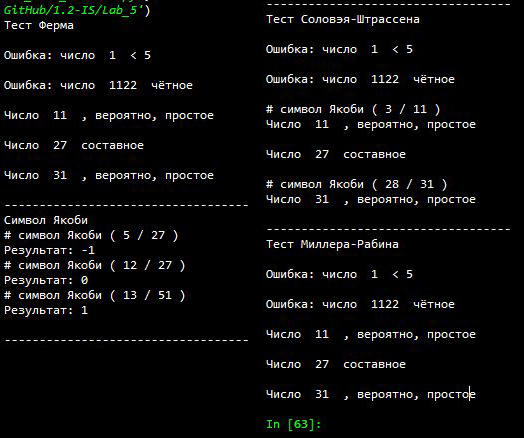

---
## Front matter
lang: ru-RU
title: |
    Отчёт по лабораторной работе №5               
    Вероятностные алгоритмы проверки чисел на простоту
author: |
    *Дисциплина: Математические основы защиты информации*  
    *и информационной безопасности*  
    \vspace{2pt}  
    **Студент:** Леонова Алина Дмитриевна, 1032212306  
		**Группа:** НФИмд-01-21                                         
		**Преподаватель:** д-р.ф.-м.н., проф. Кулябов Дмитрий Сергеевич  
    \vspace{2pt}
date: 11 декабря, 2021, Москва

## Formatting
toc: false
slide_level: 2
theme: metropolis
header-includes:
 - \metroset{progressbar=frametitle,sectionpage=progressbar,numbering=fraction}
 - '\makeatletter'
 - '\beamer@ignorenonframefalse'
 - '\makeatother'
aspectratio: 43
section-titles: true
linestretch: 1.25

mainfont: PT Serif
romanfont: PT Serif
sansfont: PT Sans
monofont: PT Mono
mainfontoptions: Ligatures=TeX
romanfontoptions: Ligatures=TeX
sansfontoptions: Ligatures=TeX,Scale=MatchLowercase
monofontoptions: Scale=MatchLowercase,Scale=0.7
---

## Цель и задание работы

\textbf{Цель работы}

Целью данной работы является ознакомление и реализация на выбранном языке программирования трёх вероятностных алгоритмов проверки чисел на простоту, а также алгоритма вычисления символа Якоби. 

\textbf{Задание}

Реализовать программно:

+ алгоритм, реализующий тест Ферма
+ алгоритм вычисления символа Якоби
+ алгоритм, реализующий тест Соловэя-Штрассена
+ алгоритм, реализующий тест Миллера-Рабина

# Теоретическое введение

## Тесты проверки простоты

Тестом простоты (или проверкой простоты) называется алгоритм, который, приняв на входе число $N$, позволяет либо не подтвердить предположение о составности числа, либо точно утверждать его простоту. Во втором случае он называется истинным тестом простоты.

## Тест Ферма

Тест Ферма опирается на малую теорему Ферма:

Если n — простое число, то оно удовлетворяет сравнению $a^{n-1}\equiv 1 ( \;mod\; n)$ для любого a, которое не делится на n.

## Тест Соловэя-Штрассена

Тест Соловея-Штрассена опирается на малую теорему Ферма и свойства символа Якоби $({{a}\over {n}})$:

+ Если n — нечетное составное число, то количество целых чисел a, взаимнопростых с n и меньших n, удовлетворяющих сравнению $a^{(n-1)/2}\equiv ({{a}\over {n}}) (\;mod \; n)$ , не превосходит $n/2$.

# Выполнение лабораторной работы

## Алгоритм, реализующий тест Ферма

{#fig:001 width=80%}

Функция, реализующая тест Ферма (см. рис. [-@fig:001]).

## Алгоритм вычисления символа Якоби

{#fig:002 width=50%}

Функция, реализующая вычисление символа Якоби (см. рис. [-@fig:002]).

## Алгоритм, реализующий тест Соловэя-Штрассена

{#fig:003 width=80%}

Функция, реализующая тест Соловэя-Штрассена (см. рис. [-@fig:003]).

## Алгоритм, реализующий тест Миллера-Рабина

{#fig:004 width=60%}

Функция, реализующая тест Миллера-Рабина (см. рис. [-@fig:004]).

## Проверка

{#fig:005 width=60%}

Функция проверок работы всех реализованных функций на пяти разных вариантах входных параметров и вызов проверки всего (см. рис. [-@fig:005]).

## Результат работы реализованных алгоритмов

{#fig:006 width=65%}

Результат выполнения программы (см. рис. [-@fig:006]).

## Выводы

Цель лабораторной работы была достигнута, три вероятностных алгоритмов проверки чисел на простоту и алгоритм вычисления символа Якоби были реализованы на языке программирования Python.