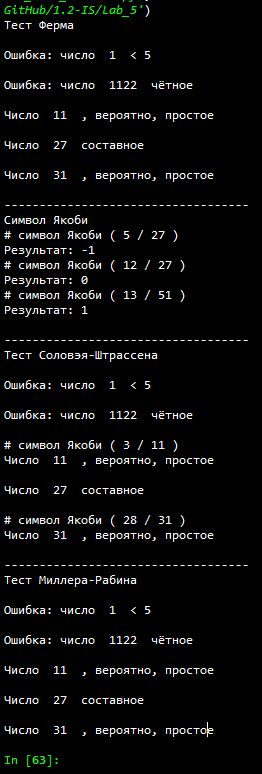

---
# Титульный лист
title: |
    Отчёт по лабораторной работе №5             
    Вероятностные алгоритмы проверки чисел на простоту                         
author:
- "Студент: Леонова Алина Дмитриевна, 1032212306"
- "Группа: НФИмд-01-21"
- "Преподаватель: Кулябов Дмитрий Сергеевич,"
- "д-р.ф.-м.н., проф."
date: "Москва 2021"

# Общие опции
lang: ru-RU
toc-title: "Содержание"

# Библиография
bibliography: bib/cite.bib
csl: pandoc/csl/gost-r-7-0-5-2008-numeric.csl

# Конвертация в ПДФ
toc: true # Содержание
toc_depth: 2
lof: true # Список изображений
lot: false # Список таблиц
fontsize: 12pt
linestretch: 1.5
papersize: a4
documentclass: scrreprt

## I18n
polyglossia-lang:
  name: russian
  options:
	- spelling=modern
	- babelshorthands=true
polyglossia-otherlangs:
  name: english
### Шрифты
mainfont: PT Serif
romanfont: PT Serif
sansfont: PT Sans
monofont: PT Mono
mainfontoptions: Ligatures=TeX
romanfontoptions: Ligatures=TeX
sansfontoptions: Ligatures=TeX,Scale=MatchLowercase
monofontoptions: Scale=MatchLowercase,Scale=0.8
## Biblatex
biblatex: true
biblio-style: "gost-numeric"
biblatexoptions:
  - parentracker=true
  - backend=biber
  - hyperref=auto
  - language=auto
  - autolang=other*
  - citestyle=gost-numeric

## Misc options
indent: true
header-includes:
  - \linepenalty=10 # the penalty added to the badness of each line within a paragraph (no associated penalty node) Increasing the value makes tex try to have fewer lines in the paragraph.
  - \interlinepenalty=0 # value of the penalty (node) added after each line of a paragraph.
  - \hyphenpenalty=50 # the penalty for line breaking at an automatically inserted hyphen
  - \exhyphenpenalty=50 # the penalty for line breaking at an explicit hyphen
  - \binoppenalty=700 # the penalty for breaking a line at a binary operator
  - \relpenalty=500 # the penalty for breaking a line at a relation
  - \clubpenalty=150 # extra penalty for breaking after first line of a paragraph
  - \widowpenalty=150 # extra penalty for breaking before last line of a paragraph
  - \displaywidowpenalty=50 # extra penalty for breaking before last line before a display math
  - \brokenpenalty=100 # extra penalty for page breaking after a hyphenated line
  - \predisplaypenalty=10000 # penalty for breaking before a display
  - \postdisplaypenalty=0 # penalty for breaking after a display
  - \floatingpenalty = 20000 # penalty for splitting an insertion (can only be split footnote in standard LaTeX)
  - \raggedbottom # or \flushbottom
  - \usepackage{float} # keep figures where there are in the text
  - \floatplacement{figure}{H} # keep figures where there are in the text

  - \usepackage{titling}
  - \setlength{\droptitle}{-9em}
  - \pretitle{\begin{center}
      \textbf{РОССИЙСКИЙ УНИВЕРСИТЕТ ДРУЖБЫ НАРОДОВ}\\
      \textbf{Факультет физико-математических и естественных наук}\\
      \textbf{Кафедра прикладной информатики и теории вероятностей}
      \vspace{9cm}
      \LARGE\\}
  - \posttitle{\vskip 1em \Large \emph{\textit{Дисциплина$:$ Математические основы защиты информации и информационной безопасности}} \end{center}}    
  - \preauthor{\vskip 3em \begin{flushright} \large \begin{tabular}[t]{c}}
  - \postauthor{\end{tabular}\par\end{flushright} \vfill \vskip 5em}
---

# Цель работы

Целью данной работы является ознакомление и реализация на выбранном языке программирования трёх вероятностных алгоритмов проверки чисел на простоту, а также алгоритма вычисления символа Якоби. 

# Задание

Реализовать программно:

+ алгоритм, реализующий тест Ферма
+ алгоритм вычисления символа Якоби
+ алгоритм, реализующий тест Соловэя-Штрассена
+ алгоритм, реализующий тест Миллера-Рабина

# Теоретическое введение

Тестом простоты (или проверкой простоты) называется алгоритм, который, приняв на входе число $N$, позволяет либо не подтвердить предположение о составности числа, либо точно утверждать его простоту. Во втором случае он называется истинным тестом простоты [@wiki1].

## Тест Ферма

Если n — простое число, то оно удовлетворяет сравнению $a^{n-1}\equiv 1 ( \;mod\; n)$ для любого a, которое не делится на n.

Выполнение сравнения $a^{n-1}\equiv 1 ( \;mod\; n)$ является необходимым, но не достаточным признаком простоты числа. То есть, если найдётся хотя бы одно a, для которого $a^{n-1}\not\equiv 1 ( \;mod \; n)$ , то число n — составное; в противном случае ничего сказать нельзя, хотя шансы на то, что число является простым, увеличиваются. Если для составного числа n выполняется сравнение $a^{n-1}\equiv 1 ( \;mod\; n)$ , то число n называют псевдопростым по основанию a [@wiki2].

## Символа Якоби

Символ Якоби — теоретико-числовая функция двух аргументов, введённая К. Якоби в 1837 году. Является квадратичным характером в кольце вычетов. Символ Якоби практически никогда не вычисляют по определению. Чаще всего для вычисления используют свойства символа Якоби, главным образом — квадратичный закон взаимности.

Ключевое используемое при вычислении свойство символа Якоби — квадратичный закон взаимности. Благодаря ему алгоритм похож на алгоритм Евклида нахождения наибольшего общего делителя двух чисел, в котором тоже аргументы на каждом шаге меняются местами. Аналогично алгоритму Евклида, при перестановке аргументов больший заменяется на остаток от деления на меньший. Это возможно благодаря периодичности символа Якоби. Однако, поскольку символ Якоби определён только при условии нечётности второго аргумента, то до перестановки выделяется чётная часть первого аргумента [@wiki3].

## Тест Соловэя-Штрассена

Тест Соловея-Штрассена — вероятностный тест простоты, открытый в 1970-х годах Робертом Мартином Соловеем совместно с Фолькером Штрассеном. Тест всегда корректно определяет, что простое число является простым, но для составных чисел с некоторой вероятностью он может дать неверный ответ [@wiki4]. 

Тест Соловея-Штрассена опирается на малую теорему Ферма и свойства символа Якоби $({{a}\over {n}})$:

+ Если n — нечетное составное число, то количество целых чисел a, взаимнопростых с n и меньших n, удовлетворяющих сравнению $a^{(n-1)/2}\equiv ({{a}\over {n}}) (\;mod \; n)$ , не превосходит $n/2$.

Составные числа n удовлетворяющие этому сравнению называются псевдопростыми Эйлера-Якоби по основанию a.

Алгоритм Соловея-Штрассена параметризуется количеством раундов $k$. В каждом раунде случайным образом выбирается число $a < n$. Если $НОД(a,n) > 1$, то выносится решение, что n составное. Иначе проверяется справедливость сравнения $a^{(n-1)/2}\equiv ({{a}\over {n}}) (\;mod \; n)$ . Если оно не выполняется, то выносится решение, что n — составное.

## Тест Миллера-Рабина

Тест Миллера-Рабина — вероятностный полиномиальный тест простоты, позволяет эффективно определить, является ли данное число составным. Однако, с его помощью нельзя строго доказать простоту числа

Как и тесты Ферма и Соловея-Штрассена, тест Миллера-Рабина опирается на проверку ряда равенств, которые выполняются для простых чисел. Если хотя бы одно такое равенство не выполняется, это доказывает что число составное [@wiki5].

Для теста Миллера-Рабина используется следующее утверждение:

Пусть $n$ — простое число и $n-1=2^{s}d$, где $d$ — нечётно. Тогда для любого $a$ выполняется хотя бы одно из условий:

+ $a^{d}\equiv 1 ( \;mod \; n)$
+ Существует целое число $r<s$ такое что $a^{2^{r}d}\equiv -1 (\;mod \; n)$


# Выполнение лабораторной работы

## Функция для проверки

Импорт используемых библиотек:

```python
import random
```

## Алгоритм, реализующий тест Ферма

Первым делом проверяю корректность входных чисел, а просле следую алгоритму из задания. 

```python
def test_Ferma(n):
    print('')
    if n % 2 == 0:
        return print('Ошибка: число ', n,' чётное')
    if n < 5:
        return print('Ошибка: число ', n,' < 5')
    
    a = random.randint(2, n - 2)
    r = ( a ** (n - 1) ) % n
    
    if r == 1:
        return print('Число ', n,' , вероятно, простое')
    else:
        return print('Число ', n,' составное')
```

## Алгоритм вычисления символа Якоби

Сперва проверяю корректность входных чисел, а просле следую алгоритму из задания. Реализован с помощью использования бесконечного цикла.

```python
def Yakobi(n, a):
    print('# символ Якоби (', a,'/',n,')')
    if n % 2 == 0:
        return print('Ошибка: число ', n,' чётное')
    if n < 3:
        return print('Ошибка: число n (', n,') < 3')
    if a < 0 or a >= n:
        return print('Ошибка: число a (', a,') некорректно')
    
    g = 1
    
    while True:
        if a == 0:
            return 0
        if a == 1:
            return g
        
        k = 0
        while a % (2**k) == 0:
            k += 1
        k -= 1
            
        a1 = a / (2**k)
        #print(a, ' = 2 ^', k, ' * ', a1)
        
        s = 0
        if k % 2 == 0:
            s = 1
        else:
            if (n - 1) % 8 == 0 or (n + 1) % 8 == 0:
                s = 1
            if (n - 3) % 8 == 0 or (n + 3) % 8 == 0:
                s = -1
            
        if a1 == 1:
            return g*s
        
        if (n - 3) % 4 == 0 and (a1 - 3) % 4 == 0:
            s = -s
            
        a = n % a1
        n = a1
        g = g*s
```

## Алгоритм, реализующий тест Соловэя-Штрассена

Первым делом проверяю корректность входных чисел, а просле следую алгоритму из задания. Симпола Якоби вычисляется вызовом реализованной ранее функции Yakobi. В алгоритме из задания исправлена ошибка на 5 шаге. 

```python
# 3. Тест Соловэя-Штрассена
def test_Sol_Shtr(n):
    print('')
    if n % 2 == 0:
        return print('Ошибка: число ', n,' чётное')
    if n < 5:
        return print('Ошибка: число ', n,' < 5')
    
    a = random.randint(2, n - 3)
    r = ( a ** ((n - 1)/2) ) % n
    
    if r != 1 and r != n-1:
        return print('Число ', n,' составное')
    
    s = Yakobi(n, a)
    
    if (r - s) % n != 0:
        return print('Число ', n,' составное')
    else:
        return print('Число ', n,' , вероятно, простое')
```

## Алгоритм, реализующий тест Миллера-Рабина

Сперва проверяю корректность входных чисел, а просле следую алгоритму из задания.

```python
# 4. Тест Миллера-Рабина
def test_Mil_Rab(n):
    print('')
    if n % 2 == 0:
        return print('Ошибка: число ', n,' чётное')
    if n < 5:
        return print('Ошибка: число ', n,' < 5')
    
    s = 0
    while n - 1 % (2**s) == 0:
        s += 1
    s -= 1
    r = (n - 1) / (2**s)
    #print(n - 1, ' = 2 ^', s, ' * ', r)
    
    a = random.randint(2, n - 3)
    y = ( a ** r ) % n
    
    if y != 1 and y != n-1:
        j = 1
        while j <= s - 1 and y != n - 1:
            y = (y*y) % n
            if y == 1:
               return print('Число ', n,' составное')
            j += 1
        if y != n - 1:
            return print('Число ', n,' составное')
    
    return print('Число ', n,' , вероятно, простое')
```

## Функция для проверки

Функция для проверки функций тестов на 5 целых числах:

```python
# Функция проверки функций тестов
def check(f):
    f(1)
    f(1122)
    f(11)
    f(27)
    f(31)
```

## Проверка

Вызов проверок работы всех реализованных функций на пяти разных вариантах входных параметров, задаваемых в функции check: 

```python
print('Тест Ферма')
check(test_Ferma)

print('\n-----------------------------------')
print('Символ Якоби')
print('Результат:', Yakobi(27, 5))
print('Результат:', Yakobi(27, 12))
print('Результат:', Yakobi(51, 13))

print('\n-----------------------------------')
print('Тест Соловэя-Штрассена')
check(test_Sol_Shtr)

print('\n-----------------------------------')
print('Тест Миллера-Рабина')
check(test_Mil_Rab)
```

{#fig:001 width=60%}

Результат выполнения программы, проверка реализации 3-ех вероятностных алгоритмов проверки чисел на простоту, а также алгоритма вычисления символа Якоби (см. рис. [-@fig:001]). Поскольку алгоритмы вероятностные, в процессе генерируется случайное $a$, реультаты последних двух алгоритмов на одних числах не всегда совпадают.

# Выводы

Цель лабораторной работы была достигнута, три вероятностных алгоритмов проверки чисел на простоту и алгоритм вычисления символа Якоби были реализованы на языке программирования Python.

# Список литературы{.unnumbered}

::: {#refs}
:::
