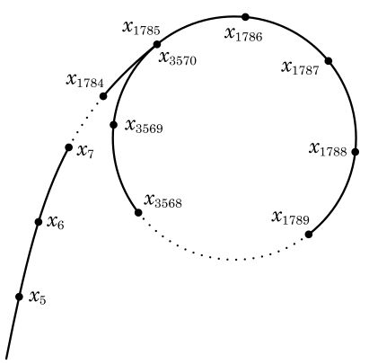
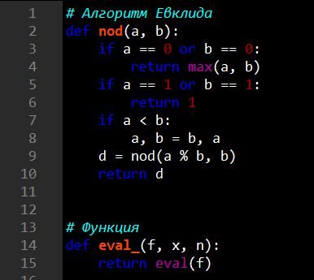
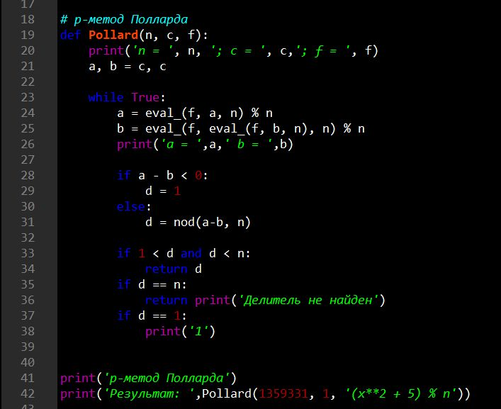
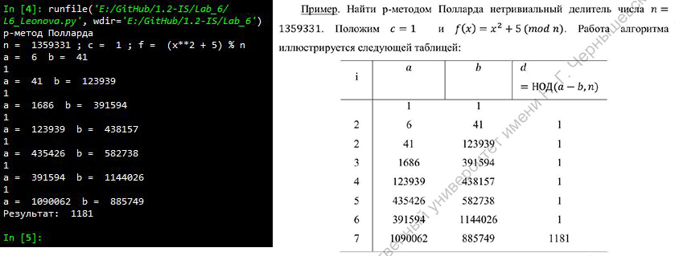

---
## Front matter
lang: ru-RU
title: |
    Отчёт по лабораторной работе №6.  
    Разложение чисел на множители
author: |
    *Дисциплина: Математические основы защиты информации*  
    *и информационной безопасности*  
    \vspace{2pt}  
    **Студент:** Леонова Алина Дмитриевна, 1032212306  
		**Группа:** НФИмд-01-21                                         
		**Преподаватель:** д-р.ф.-м.н., проф. Кулябов Дмитрий Сергеевич  
    \vspace{2pt}
date: 18 декабря, 2021, Москва

## Formatting
toc: false
slide_level: 2
theme: metropolis
header-includes:
 - \metroset{progressbar=frametitle,sectionpage=progressbar,numbering=fraction}
 - '\makeatletter'
 - '\beamer@ignorenonframefalse'
 - '\makeatother'
aspectratio: 43
section-titles: true
linestretch: 1.25

mainfont: PT Serif
romanfont: PT Serif
sansfont: PT Sans
monofont: PT Mono
mainfontoptions: Ligatures=TeX
romanfontoptions: Ligatures=TeX
sansfontoptions: Ligatures=TeX,Scale=MatchLowercase
monofontoptions: Scale=MatchLowercase,Scale=0.7
---

## Цель и задание работы

\textbf{Цель работы}

Целью данной работы является ознакомление с методом разложения чисел на множители и реализация этого метода на выбранном языке программирования. 

\textbf{Задание}

1. Реализовать рассмотренный алгоритм программно.
2. Разложить на множители данное преподавателем число.

# Теоретическое введение

## $\rho$-метод Полларда

$\rho$-алгоритм предложен Джоном Поллардом в 1975 году для факторизации (разложения на множители) целых чисел. Данный алгоритм основывается на алгоритме Флойда поиска длины цикла в последовательности и некоторых следствиях из парадокса дней рождения. Алгоритм наиболее эффективен при факторизации составных чисел с достаточно малыми множителями в разложении. 

Сложность алгоритма оценивается как $O(N^{1/4})$.

## $\rho$-метод Полларда

{#fig:001 width=30%}

$\rho$-алгоритм Полларда строит числовую последовательность, элементы которой образуют цикл, начиная с некоторого номера n, что может быть проиллюстрировано, расположением чисел в виде греческой буквы $\rho$ (см. рис. [-@fig:001]), что послужило названием семейству алгоритмов.

# Выполнение лабораторной работы

## Промежуточные функции

{#fig:003 width=40%}

Функция для нахождения наибольшего общего делителя a и b - Алгоритм Евклида, и функция eval_ для нахождения результата переданной как строки функции f с переданными аргументами x и n (см. рис. [-@fig:003]). 

## Реализация $\rho$-метода Полларда

{#fig:004 width=80%}

Функция, реализующая алгоритм $\rho$-метод Полларда (см. рис. [-@fig:004]).

## Результаты

{#fig:005 width=90%}

Результат выполнения программы, проверка реализации $\rho$-метода Полларда, разложение на множители данного в задании числа (см. рис. [-@fig:005]).

## Выводы

Цель лабораторной работы была достигнута, метод разложения чисел на множители - $\rho$-Метод Полларда - был реализован на языке программирования Python.
