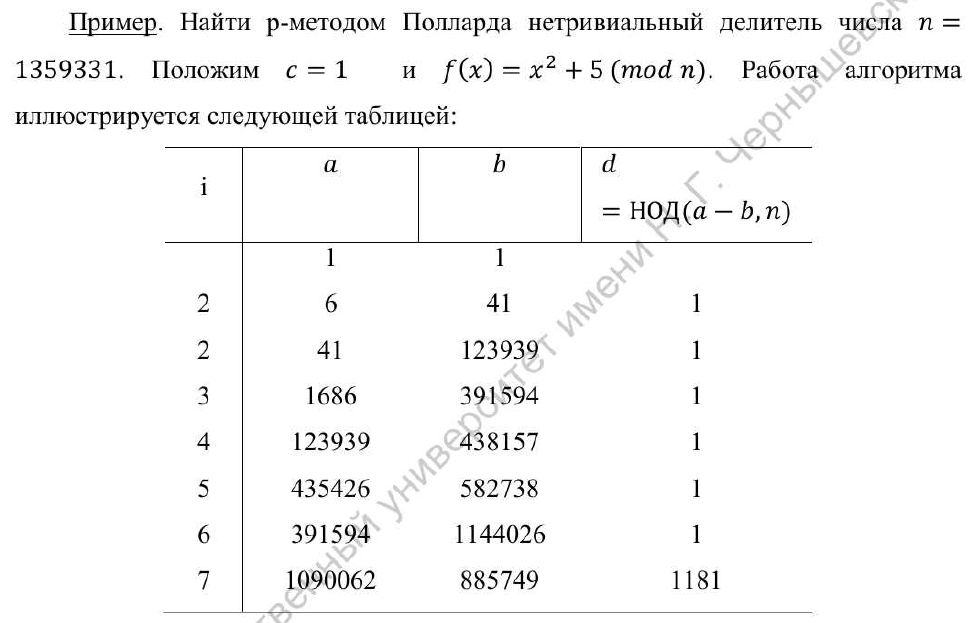
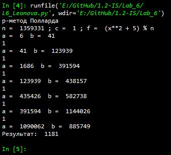

---
# Титульный лист
title: |
    Отчёт по лабораторной работе №6             
    Разложение чисел на множители                         
author:
- "Студент: Леонова Алина Дмитриевна, 1032212306"
- "Группа: НФИмд-01-21"
- "Преподаватель: Кулябов Дмитрий Сергеевич,"
- "д-р.ф.-м.н., проф."
date: "Москва 2021"

# Общие опции
lang: ru-RU
toc-title: "Содержание"

# Библиография
bibliography: bib/cite.bib
csl: pandoc/csl/gost-r-7-0-5-2008-numeric.csl

# Конвертация в ПДФ
toc: true # Содержание
toc_depth: 2
lof: true # Список изображений
lot: false # Список таблиц
fontsize: 12pt
linestretch: 1.5
papersize: a4
documentclass: scrreprt

## I18n
polyglossia-lang:
  name: russian
  options:
	- spelling=modern
	- babelshorthands=true
polyglossia-otherlangs:
  name: english
### Шрифты
mainfont: PT Serif
romanfont: PT Serif
sansfont: PT Sans
monofont: PT Mono
mainfontoptions: Ligatures=TeX
romanfontoptions: Ligatures=TeX
sansfontoptions: Ligatures=TeX,Scale=MatchLowercase
monofontoptions: Scale=MatchLowercase,Scale=0.8
## Biblatex
biblatex: true
biblio-style: "gost-numeric"
biblatexoptions:
  - parentracker=true
  - backend=biber
  - hyperref=auto
  - language=auto
  - autolang=other*
  - citestyle=gost-numeric

## Misc options
indent: true
header-includes:
  - \linepenalty=10 # the penalty added to the badness of each line within a paragraph (no associated penalty node) Increasing the value makes tex try to have fewer lines in the paragraph.
  - \interlinepenalty=0 # value of the penalty (node) added after each line of a paragraph.
  - \hyphenpenalty=50 # the penalty for line breaking at an automatically inserted hyphen
  - \exhyphenpenalty=50 # the penalty for line breaking at an explicit hyphen
  - \binoppenalty=700 # the penalty for breaking a line at a binary operator
  - \relpenalty=500 # the penalty for breaking a line at a relation
  - \clubpenalty=150 # extra penalty for breaking after first line of a paragraph
  - \widowpenalty=150 # extra penalty for breaking before last line of a paragraph
  - \displaywidowpenalty=50 # extra penalty for breaking before last line before a display math
  - \brokenpenalty=100 # extra penalty for page breaking after a hyphenated line
  - \predisplaypenalty=10000 # penalty for breaking before a display
  - \postdisplaypenalty=0 # penalty for breaking after a display
  - \floatingpenalty = 20000 # penalty for splitting an insertion (can only be split footnote in standard LaTeX)
  - \raggedbottom # or \flushbottom
  - \usepackage{float} # keep figures where there are in the text
  - \floatplacement{figure}{H} # keep figures where there are in the text

  - \usepackage{titling}
  - \setlength{\droptitle}{-9em}
  - \pretitle{\begin{center}
      \textbf{РОССИЙСКИЙ УНИВЕРСИТЕТ ДРУЖБЫ НАРОДОВ}\\
      \textbf{Факультет физико-математических и естественных наук}\\
      \textbf{Кафедра прикладной информатики и теории вероятностей}
      \vspace{9cm}
      \LARGE\\}
  - \posttitle{\vskip 1em \Large \emph{\textit{Дисциплина$:$ Математические основы защиты информации и информационной безопасности}} \end{center}}    
  - \preauthor{\vskip 3em \begin{flushright} \large \begin{tabular}[t]{c}}
  - \postauthor{\end{tabular}\par\end{flushright} \vfill \vskip 5em}
---

# Цель работы

Целью данной работы является ознакомление с методом разложения чисел на множители и реализация этого метода на выбранном языке программирования. 

# Задание

1. Реализовать рассмотренный алгоритм программно.
2. Разложить на множители данное преподавателем число.

# Теоретическое введение

Процесс разложения составного числа на множителе является факторизацией. В отличие от задачи распознавания простоты числа, факторизация предположительно является вычислительно сложной задачей [@wiki1].

## $\rho$-метод Полларда

$\rho$-алгоритм предложен Джоном Поллардом в 1975 году для факторизации целых чисел. Данный алгоритм основывается на алгоритме Флойда поиска длины цикла в последовательности и некоторых следствиях из парадокса дней рождения. Алгоритм наиболее эффективен при факторизации составных чисел с достаточно малыми множителями в разложении. Сложность алгоритма оценивается как $O(N^{1/4})$.

{#fig:001 width=80%}

$\rho$-алгоритм Полларда строит числовую последовательность, элементы которой образуют цикл, начиная с некоторого номера n, что может быть проиллюстрировано, расположением чисел в виде греческой буквы $\rho$ (см. рис. [-@fig:001]), что послужило названием семейству алгоритмов [@wiki2].

## Пример из задания

{#fig:002 width=100%}

Пример работы алгоритма, на котором требуется проверить свою реализацию (см. рис. [-@fig:002]).

# Выполнение лабораторной работы

## Промежуточные функции

Функция для нахождения наибольшего общего делителя a и b - Алгоритм Евклида. Взят из лабораторной работы №4.

```python
# Алгоритм Евклида
def nod(a, b):
    if a == 0 or b == 0:
        return max(a, b)
    if a == 1 or b == 1:
        return 1
    if a < b:
        a, b = b, a
    d = nod(a % b, b)
    return d
```

Функция eval_ для нахождения результата переданной как строки функции f с переданными аргументами x и n: 

```python
# Функция
def eval_(f, x, n):
    return eval(f)
```

## $\rho$-метод Полларда

Функция, реализующая $\rho$-метод Полларда, следуя алгоритму из задания. Возвращение ко 2 шагу реализовано с помощью использования бесконечного цикла.

```python
def Pollard(n, c, f):
    print('n = ', n, '; c = ', c,'; f = ', f)
    a, b = c, c

    while True:
        a = eval_(f, a, n) % n
        b = eval_(f, eval_(f, b, n), n) % n
        print('a = ',a,' b = ',b)
        
        if a - b < 0:
            d = 1
        else:
            d = nod(a-b, n)
        
        if 1 < d and d < n:
            return d
        if d == n:
            return print('Делитель не найден')
        if d == 1:
            print('1')
```

{#fig:003 width=80%}

Результат выполнения программы, проверка реализации $\rho$-метода Полларда, разложение на множители данного в задании числа (см. рис. [-@fig:003]).

# Выводы

Цель лабораторной работы была достигнута, метод разложения чисел на множители - $\rho$-Метод Полларда - был реализован на языке программирования Python.

# Список литературы{.unnumbered}

::: {#refs}
:::
