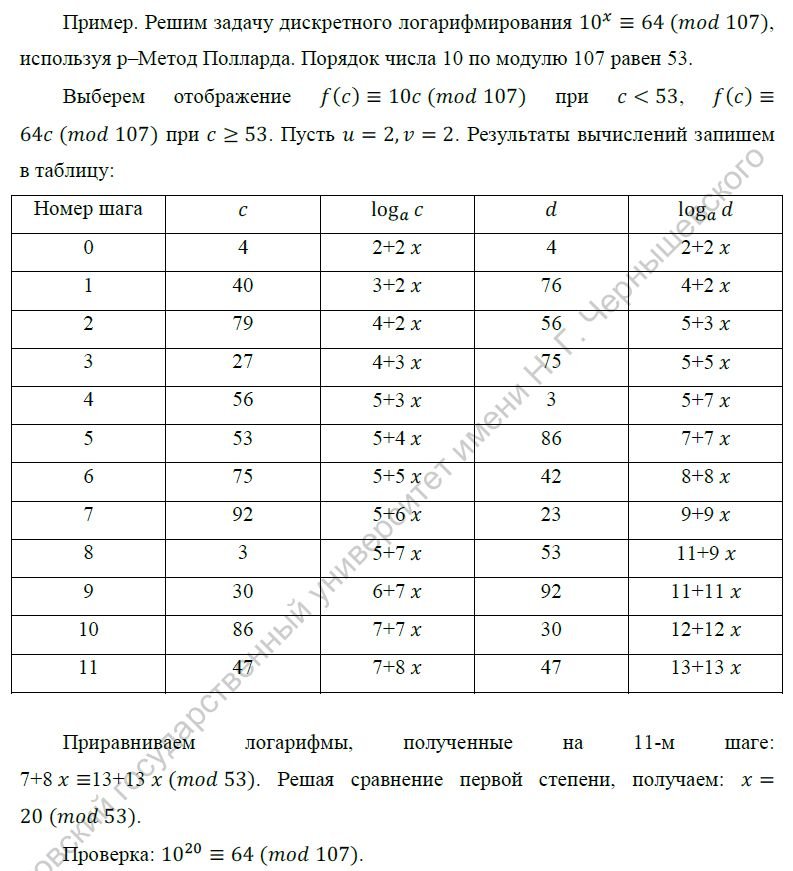
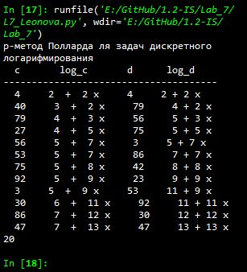

---
## Front matter
lang: ru-RU
title: |
    Отчёт по лабораторной работе №7.  
    Дискретное логарифмирование в конечном поле
author: |
    *Дисциплина: Математические основы защиты информации*  
    *и информационной безопасности*  
    \vspace{2pt}  
    **Студент:** Леонова Алина Дмитриевна, 1032212306  
		**Группа:** НФИмд-01-21                                         
		**Преподаватель:** д-р.ф.-м.н., проф. Кулябов Дмитрий Сергеевич  
    \vspace{2pt}
date: 25 декабря, 2021, Москва

## Formatting
toc: false
slide_level: 2
theme: metropolis
header-includes:
 - \metroset{progressbar=frametitle,sectionpage=progressbar,numbering=fraction}
 - '\makeatletter'
 - '\beamer@ignorenonframefalse'
 - '\makeatother'
aspectratio: 43
section-titles: true
linestretch: 1.25

mainfont: PT Serif
romanfont: PT Serif
sansfont: PT Sans
monofont: PT Mono
mainfontoptions: Ligatures=TeX
romanfontoptions: Ligatures=TeX
sansfontoptions: Ligatures=TeX,Scale=MatchLowercase
monofontoptions: Scale=MatchLowercase,Scale=0.7
---

## Цель и задание работы

\textbf{Цель работы}

Целью данной работы является ознакомление с $\rho$-методом Полларда для задач дискретного логарифмирования и его реализация на выбранном языке программирования. 

\textbf{Задание}

+ Реализовать алгоритм программно.
+ Получить у преподавателя задание, содержащее числа $p$, $a$, $b$ и вычислить
логарифм.

# Теоретическое введение

## Дискретное логарифмирование в конечном поле

Задача дискретного логарифмирования, как и задача разложения на множители, применяется во многих алгоритмах криптографии с открытым ключом. Предложенная в 1976 году У. Диффи и М. Хеллманом для установления сеансового ключа, эта задача послужила основой для создания протоколов шифрования и цифровой подписи, доказательств с нулевым разглашением и других криптографических протоколов.

## Алгоритм, реализующий $\rho$–Метод Полларда для задач дискретного логарифмирования.

{#fig:001 width=90%}

## Пример

{#fig:002 width=70%}

Для проверки правильности реализации в задании дан пример (см. рис. [-@fig:002]).

# Выполнение лабораторной работы

## Промежуточные функции

{#fig:003 width=70%}

Функция для вычисления НОД(a,b) расширенным алгоритмом Евклида, функция для вычисления значения соответствующей функции в зависимости от $c$, функция для печати промежуточных шагов (см. рис. [-@fig:003]).

## p-метод Полларда для задач дискретного логарифмирования

{#fig:004 width=55%}

## Результат проверка работы алгорима

{#fig:005 width=40%}

Результат выполнения программы, проверка реализации p-метод Полларда для задач дискретного логарифмирования на заданном примере (см. рис. [-@fig:005]).

## Выводы

Цель лабораторной работы была достигнута, $\rho$-метод Полларда для задач дискретного логарифмирования был реализован на языке программирования Python и проверен на заданном примере. 