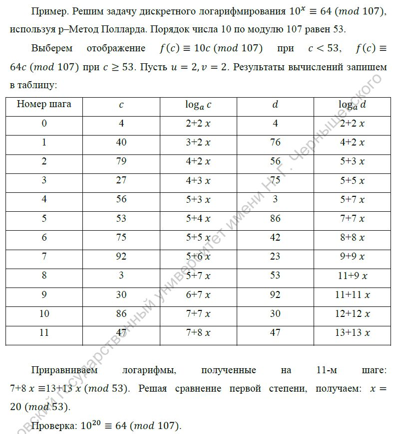
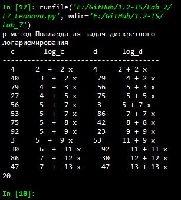

---
# Титульный лист
title: |
    Отчёт по лабораторной работе №7             
    Дискретное логарифмирование в конечном поле                         
author:
- "Студент: Леонова Алина Дмитриевна, 1032212306"
- "Группа: НФИмд-01-21"
- "Преподаватель: Кулябов Дмитрий Сергеевич,"
- "д-р.ф.-м.н., проф."
date: "Москва 2021"

# Общие опции
lang: ru-RU
toc-title: "Содержание"

# Библиография
bibliography: bib/cite.bib
csl: pandoc/csl/gost-r-7-0-5-2008-numeric.csl

# Конвертация в ПДФ
toc: true # Содержание
toc_depth: 2
lof: true # Список изображений
lot: false # Список таблиц
fontsize: 12pt
linestretch: 1.5
papersize: a4
documentclass: scrreprt

## I18n
polyglossia-lang:
  name: russian
  options:
	- spelling=modern
	- babelshorthands=true
polyglossia-otherlangs:
  name: english
### Шрифты
mainfont: PT Serif
romanfont: PT Serif
sansfont: PT Sans
monofont: PT Mono
mainfontoptions: Ligatures=TeX
romanfontoptions: Ligatures=TeX
sansfontoptions: Ligatures=TeX,Scale=MatchLowercase
monofontoptions: Scale=MatchLowercase,Scale=0.8
## Biblatex
biblatex: true
biblio-style: "gost-numeric"
biblatexoptions:
  - parentracker=true
  - backend=biber
  - hyperref=auto
  - language=auto
  - autolang=other*
  - citestyle=gost-numeric

## Misc options
indent: true
header-includes:
  - \linepenalty=10 # the penalty added to the badness of each line within a paragraph (no associated penalty node) Increasing the value makes tex try to have fewer lines in the paragraph.
  - \interlinepenalty=0 # value of the penalty (node) added after each line of a paragraph.
  - \hyphenpenalty=50 # the penalty for line breaking at an automatically inserted hyphen
  - \exhyphenpenalty=50 # the penalty for line breaking at an explicit hyphen
  - \binoppenalty=700 # the penalty for breaking a line at a binary operator
  - \relpenalty=500 # the penalty for breaking a line at a relation
  - \clubpenalty=150 # extra penalty for breaking after first line of a paragraph
  - \widowpenalty=150 # extra penalty for breaking before last line of a paragraph
  - \displaywidowpenalty=50 # extra penalty for breaking before last line before a display math
  - \brokenpenalty=100 # extra penalty for page breaking after a hyphenated line
  - \predisplaypenalty=10000 # penalty for breaking before a display
  - \postdisplaypenalty=0 # penalty for breaking after a display
  - \floatingpenalty = 20000 # penalty for splitting an insertion (can only be split footnote in standard LaTeX)
  - \raggedbottom # or \flushbottom
  - \usepackage{float} # keep figures where there are in the text
  - \floatplacement{figure}{H} # keep figures where there are in the text

  - \usepackage{titling}
  - \setlength{\droptitle}{-9em}
  - \pretitle{\begin{center}
      \textbf{РОССИЙСКИЙ УНИВЕРСИТЕТ ДРУЖБЫ НАРОДОВ}\\
      \textbf{Факультет физико-математических и естественных наук}\\
      \textbf{Кафедра прикладной информатики и теории вероятностей}
      \vspace{9cm}
      \LARGE\\}
  - \posttitle{\vskip 1em \Large \emph{\textit{Дисциплина$:$ Математические основы защиты информации и информационной безопасности}} \end{center}}    
  - \preauthor{\vskip 3em \begin{flushright} \large \begin{tabular}[t]{c}}
  - \postauthor{\end{tabular}\par\end{flushright} \vfill \vskip 5em}
---

# Цель работы

Целью данной работы является ознакомление с $\rho$-методом Полларда для задач дискретного логарифмирования и его реализация на выбранном языке программирования. 

# Задание

+ Реализовать алгоритм программно.
+ Получить у преподавателя задание, содержащее числа $p$, $a$, $b$ и вычислить
логарифм.

# Теоретическое введение

Задача дискретного логарифмирования, как и задача разложения на
множители, применяется во многих алгоритмах криптографии с открытым
ключом. Предложенная в 1976 году У. Диффи и М. Хеллманом для установления
сеансового ключа, эта задача послужила основой для создания протоколов
шифрования и цифровой подписи, доказательств с нулевым разглашением и
других криптографических протоколов.

## Алгоритм, реализующий $\rho$–Метод Полларда для задач дискретного логарифмирования.

Вход. Простое число $p$, число $a$ порядка $r$ по модулю $p$, целое число $b$, 1 < $b$ < $p$; 
отображение $f$, обладающее сжимающими свойствами и сохраняющее вычислимость логарифма.

Выход. Показатель $x$, для которого $a^{x} \equiv b ( \;mod\; p)$, если такой показатель существует.

1. Выбрать произвольные целые числа $u$, $v$ и положить $c <- a^{u}b^{v} (\;mod\; p), d <- c$.

2. Выполнять $c <- f(c) (\;mod\; p), d <- f(f(d)) (\;mod\; p)$, вычисляя при этом логарифмы для $c$ и $d$ как линейные функции от $x$ по модулю $r$, до получения равенства $c \equiv d ( \;mod\; p)$.

3. Приравняв логарифмы для $c$ и $d$, вычислить логарифм $x$ решением сравнения по модулю $r$. Результат: $x$ или "Решений нет".

## Пример

{#fig:001 width=100%}

Для проверки правильности реализации в задании дан пример (см. рис. [-@fig:001]) [@manual].


# Выполнение лабораторной работы

## Промежуточные функции

Функция для вычисления НОД(a,b) расширенным алгоритмом Евклида, взятая с небольшими изменениями из 4 лабораторной работы:

```python
# Расширенный алгоритм Евклида
# d = НОД(a,b) = ax + by
def nod3(a, b):
    if a == 0 or b == 0:
        return max(a, b)
    if a == 1 or b == 1:
        return 1
    if abs(a) < abs(b):
        a, b = abs(b), abs(a)

    x, y = [1,0], [0,1]
    a_, b_ = a, b
    
    while b_ != 0:
        a_, b_, p = b_, a_ % b_, a_ // b_
        
        x[0], x[1] = x[1], x[0] - p*x[1]
        y[0], y[1] = y[1], y[0] - p*y[1]
    
    d = a_
    #print(a,'*',x[1],' + ',b,'*',y[1],' = ',d)
    return d, abs(y[0]), abs(x[0])
```

Далее функция для вычисления значения соответствующей функции в зависимости от $с$:

```python
# Функция
def f(c, u, v):
    if c < r:
        return a*c % p, u+1, v
    else:
        return b*c % p, u, v+1
```

Функция для печати промежуточных шагов: 

```python
def pr(c,uc,vc,d,ud,vd):
    print(' ',c,'   ',uc,' + ',vc,'x    ', d,'   ',ud,'+',vd,'x')
```

## p-метод Полларда для задач дискретного логарифмирования

с использованием расширенного алгоритма Евклида:

```python
def Pollard_log(a, p, r, b, u, v):
    c = a**u * b**v % p
    d = c
    uc, vc = u, v
    ud, vd = u, v

    print('  c       log_c       d      log_d')
    print('--------------------------------------')
    pr(c,uc,vd,d,ud,vd)    

    c, uc, vc = f(c, uc, vc)
    c %= p
    d, ud, vd = f(*f(d, ud, vd))
    d %= p
    pr(c,uc,vd,d,ud,vd)
    
    while c%p != d%p:
        c, uc, vc = f(c, uc, vc)
        c %= p
        d, ud, vd = f(*f(d, ud, vd))
        d %= p
        pr(c,uc,vd,d,ud,vd)
              
    v = vc - vd
    u = ud - uc
    
    d, x, y = nod3(v, r)
    
    while d != 1:
        v /= d
        u /= d
        r /= d
        d, x, y = nod3(v, r)
        pr(c,uc,vd,d,ud,vd)
    
    return x*u % r
```

## Проверка работы алгорима

Проверка работы алгорима на примере из задания:

```python
print('p-метод Полларда ля задач дискретного логарифмирования')
a = 10
p = 107
r = 53
b = 64
u = 2
v = 2
print(Pollard_log(a, p, r, b, u, v))
```

{#fig:002 width=60%}

Результат выполнения программы, проверка реализации p-метод Полларда для задач дискретного логарифмирования на заданном примере (см. рис. [-@fig:002]).

# Выводы

Цель лабораторной работы была достигнута, $\rho$-метод Полларда для задач дискретного логарифмирования был реализован на языке программирования Python и проверен на заданном примере. 

# Список литературы{.unnumbered}

::: {#refs}
:::
