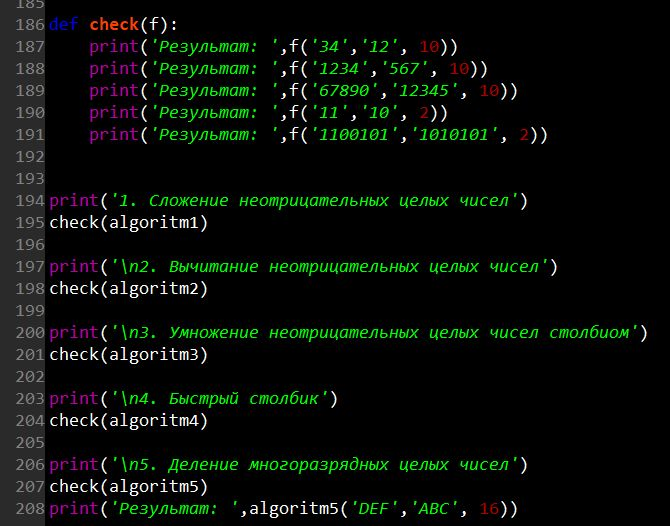

---
## Front matter
lang: ru-RU
title: |
    Отчёт по лабораторной работе №8.  
    Целочисленная арифметика многократной точности
author: |
    *Дисциплина: Математические основы защиты информации*  
    *и информационной безопасности*  
    \vspace{2pt}  
    **Студент:** Леонова Алина Дмитриевна, 1032212306  
		**Группа:** НФИмд-01-21                                         
		**Преподаватель:** д-р.ф.-м.н., проф. Кулябов Дмитрий Сергеевич  
    \vspace{2pt}
date: 25 декабря, 2021, Москва

## Formatting
toc: false
slide_level: 2
theme: metropolis
header-includes:
 - \metroset{progressbar=frametitle,sectionpage=progressbar,numbering=fraction}
 - '\makeatletter'
 - '\beamer@ignorenonframefalse'
 - '\makeatother'
aspectratio: 43
section-titles: true
linestretch: 1.25

mainfont: PT Serif
romanfont: PT Serif
sansfont: PT Sans
monofont: PT Mono
mainfontoptions: Ligatures=TeX
romanfontoptions: Ligatures=TeX
sansfontoptions: Ligatures=TeX,Scale=MatchLowercase
monofontoptions: Scale=MatchLowercase,Scale=0.7
---

## Цель и задание работы

\textbf{Цель работы}

Целью данной работы является ознакомление с 5 алгоримами для выполнения арифметических операций с большими целыми числами и их реализация. 

\textbf{Задание}

Реализовать программно алгоритмы:

+ сложение неотрицательных целых чисел
+ вычитание неотрицательных целых чисел
+ умножение неотрицательных целых чисел столбиком
+ быстрый столбик
+ деление многоразрядных целых чисел

# Теоретическое введение

## Целочисленная арифметика многократной точности

Рассмотрим алгоритмы для выполнения арифметических операций с большими целыми числами. Будем считать, что число записано в $b$-ичной системе счисления, $b$ – натуральное число, $b$ ≥ 2. 

При работе с большими целыми числами знак такого числа удобно хранить в отдельной переменной. Например, при умножении двух чисел, знак произведения вычисляется отдельно. Квадратные скобки обозначают, что берется целая часть числа.

## Алгоритм 1 (сложение неотрицательных целых чисел)

{#fig:001 width=80%}

## Алгоритм 5 (деление многоразрядных целых чисел).

{#fig:002 width=80%}

# Выполнение лабораторной работы

## Реализация алгоритма 1 (сложение неотрицательных целых чисел)

{#fig:003 width=65%}

## Реализация алгоритма 2 (вычитание неотрицательных целых чисел)

{#fig:004 width=70%}

## Реализация алгоритма 3 (умножение неотрицательных целых чисел столбиком)

{#fig:005 width=70%}

## Реализация алгоритма 4 (быстрый столбик)

{#fig:006 width=65%}

## Промежуточные функции для 5 алгоритма

{#fig:007 width=70%}

## Реализация алгоритма 5 (деление многоразрядных целых чисел)

{#fig:008 width=70%}

## Проверки

{#fig:009 width=70%}

## Результат работы реализованных алгоритмов

{#fig:010 width=100%}

## Выводы

Цель лабораторной работы была достигнута, 5 алгоритмов для выполнения арифметических операций с большими целыми числами были реализованы на языке программирования Python.