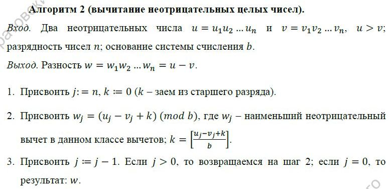

---
# Титульный лист
title: |
    Отчёт по лабораторной работе №8             
    Целочисленная арифметика многократной точности                         
author:
- "Студент: Леонова Алина Дмитриевна, 1032212306"
- "Группа: НФИмд-01-21"
- "Преподаватель: Кулябов Дмитрий Сергеевич,"
- "д-р.ф.-м.н., проф."
date: "Москва 2021"

# Общие опции
lang: ru-RU
toc-title: "Содержание"

# Библиография
bibliography: bib/cite.bib
csl: pandoc/csl/gost-r-7-0-5-2008-numeric.csl

# Конвертация в ПДФ
toc: true # Содержание
toc_depth: 2
lof: true # Список изображений
lot: false # Список таблиц
fontsize: 12pt
linestretch: 1.5
papersize: a4
documentclass: scrreprt

## I18n
polyglossia-lang:
  name: russian
  options:
	- spelling=modern
	- babelshorthands=true
polyglossia-otherlangs:
  name: english
### Шрифты
mainfont: PT Serif
romanfont: PT Serif
sansfont: PT Sans
monofont: PT Mono
mainfontoptions: Ligatures=TeX
romanfontoptions: Ligatures=TeX
sansfontoptions: Ligatures=TeX,Scale=MatchLowercase
monofontoptions: Scale=MatchLowercase,Scale=0.8
## Biblatex
biblatex: true
biblio-style: "gost-numeric"
biblatexoptions:
  - parentracker=true
  - backend=biber
  - hyperref=auto
  - language=auto
  - autolang=other*
  - citestyle=gost-numeric

## Misc options
indent: true
header-includes:
  - \linepenalty=10 # the penalty added to the badness of each line within a paragraph (no associated penalty node) Increasing the value makes tex try to have fewer lines in the paragraph.
  - \interlinepenalty=0 # value of the penalty (node) added after each line of a paragraph.
  - \hyphenpenalty=50 # the penalty for line breaking at an automatically inserted hyphen
  - \exhyphenpenalty=50 # the penalty for line breaking at an explicit hyphen
  - \binoppenalty=700 # the penalty for breaking a line at a binary operator
  - \relpenalty=500 # the penalty for breaking a line at a relation
  - \clubpenalty=150 # extra penalty for breaking after first line of a paragraph
  - \widowpenalty=150 # extra penalty for breaking before last line of a paragraph
  - \displaywidowpenalty=50 # extra penalty for breaking before last line before a display math
  - \brokenpenalty=100 # extra penalty for page breaking after a hyphenated line
  - \predisplaypenalty=10000 # penalty for breaking before a display
  - \postdisplaypenalty=0 # penalty for breaking after a display
  - \floatingpenalty = 20000 # penalty for splitting an insertion (can only be split footnote in standard LaTeX)
  - \raggedbottom # or \flushbottom
  - \usepackage{float} # keep figures where there are in the text
  - \floatplacement{figure}{H} # keep figures where there are in the text

  - \usepackage{titling}
  - \setlength{\droptitle}{-9em}
  - \pretitle{\begin{center}
      \textbf{РОССИЙСКИЙ УНИВЕРСИТЕТ ДРУЖБЫ НАРОДОВ}\\
      \textbf{Факультет физико-математических и естественных наук}\\
      \textbf{Кафедра прикладной информатики и теории вероятностей}
      \vspace{9cm}
      \LARGE\\}
  - \posttitle{\vskip 1em \Large \emph{\textit{Дисциплина$:$ Математические основы защиты информации и информационной безопасности}} \end{center}}    
  - \preauthor{\vskip 3em \begin{flushright} \large \begin{tabular}[t]{c}}
  - \postauthor{\end{tabular}\par\end{flushright} \vfill \vskip 5em}
---

# Цель работы

Целью данной работы является ознакомление с 5 алгоримами для выполнения арифметических операций с большими целыми числами и их реализация на выбранном языке программирования. 

# Задание

Реализовать программно алгоритмы:

+ сложение неотрицательных целых чисел
+ вычитание неотрицательных целых чисел
+ умножение неотрицательных целых чисел столбиком
+ быстрый столбик
+ деление многоразрядных целых чисел


# Теоретическое введение

Рассмотрим алгоритмы для выполнения арифметических операций с большими целыми числами. Будем считать, что число записано в $b$-ичной системе счисления, $b$ – натуральное число, $b$ ≥ 2. 

При работе с большими целыми числами знак такого числа удобно хранить в отдельной переменной. Например, при умножении двух чисел, знак произведения вычисляется отдельно. Квадратные скобки обозначают, что берется целая часть числа [@manual].

## Алгоритм 1 (сложение неотрицательных целых чисел)

{#fig:001 width=100%}

Описание алгоритма 1 (см. рис. [-@fig:001]).

## Алгоритм 2 (вычитание неотрицательных целых чисел).

{#fig:002 width=100%}

Описание алгоритма 2 (см. рис. [-@fig:002]).

## Алгоритм 3 (умножение неотрицательных целых чисел столбиком).

{#fig:003 width=100%}

Описание алгоритма 3 (см. рис. [-@fig:003]).

## Алгоритм 4 (быстрый столбик).

{#fig:004 width=100%}

Описание алгоритма 4 (см. рис. [-@fig:004]).

## Алгоритм 5 (деление многоразрядных целых чисел).

{#fig:005 width=100%}

Описание алгоритма 5 (см. рис. [-@fig:005]).


# Выполнение лабораторной работы

В каждом алгоритме первым делом проверяется корректность входных параметров.

## Реализация алгоритма 1 (сложение неотрицательных целых чисел)

```python
# 1. Сложение неотрицательных целых чисел 
# b - система счисления
def algoritm1(u, v, b):
    n = len(u)
    print('* ', u, v, n, b)
    if len(u) != len(v):
        return print('Ошибка, числа разной разрядности')
    
    u, v, w = list(u), list(v), []
    k = 0

    for j in range(n-1,-1,-1):
        a = int(u[j]) + int(v[j]) + k
        w.append(a % b)
        k = a // b
        #print(j, a, w, k)
                 
    w.append(k)
    res = ''
    for i in w[::-1]:
        res += str(i)
    return res
```

## Реализация алгоритма 2 (вычитание неотрицательных целых чисел)

```python
# 2. Вычитание неотрицательных целых чисел 
def algoritm2(u, v, b):
    n = len(u)
    print('* ', u, v, n, b)
    if int(u) < int(v):
        return print('Ошибка, u < v')
    if len(u) != len(v):
        return print('Ошибка, числа разной разрядности')
    
    u, v, w = list(u), list(v), []
    k = 0

    for j in range(n-1,-1,-1):
        a = int(u[j]) - int(v[j]) + k
        w.append(a % b)
        k = a // b
        #print(j, a, w, k)
                 
    w.append(k)
    res = ''
    for i in w[::-1]:
        res += str(i)
    return res
```

## Реализация алгоритма 3 (умножение неотрицательных целых чисел столбиком)

```python
# 3. Умножение неотрицательных целых чисел столбиом
def algoritm3(u, v, b):
    if u < v:
        u, v = v, u
    print('* ', u, v, b)
    
    n = len(u)
    m = len(v)
    u, v = list(u), list(v)
    w = [0] * (m + n)
    
    for j in range(m-1,-1,-1):
        if v[j] != 0:
            k = 0
            for i in range(n-1,-1,-1):
                t = int(u[i]) * int(v[j]) + w[i+j+1] + k
                w[i+j+1] = t % b 
                k = t // b
                #print(j,i, t, w, k)
            
            w[j] = k

    res = ''
    for i in w:
        res += str(i)
    return res
```

## Реализация алгоритма 4 (быстрый столбик)

```python
# 4. Быстрый столбик
def algoritm4(u, v, b):
    if u < v:
        u, v = v, u
    print('* ', u, v, b)
    
    t = 0
    n = len(u)
    m = len(v)
    u, v = list(u), list(v)
    w = [0] * (m + n)
    
    for s in range(0, m + n):
        for i in range(0, s + 1):
            if 0 <= n-i-1 < n and 0 <= m-s+i-1 < m:
                t += int(u[n-i-1]) * int(v[m-s+i-1])
        
        #print(s, i, t)
        w[m+n-s-1] = t % b
        t = t // b

    res = ''
    for i in w:
        res += str(i)
    return res
```

## Промежуточные функции

Словари для перевода в системы счисления более 10

```python
# словарь {символ: число}
str2num = {chr(i) : (i - ord('A') + 10) for i in range(ord('A'),ord('Z'))}
for i in '0123456789':
    str2num[i] = int(i)
# словарь {число: символ}
num2str = {value : key for (key, value) in str2num.items()}
```
Функци для перевода числа в десятичное и в b-ичное

```python
# перевод b-ичного числа в десятичное
def to_10(u_str, b, array = False):
    # array = True, если число u передано в виде массива чисел
    u_array = u_str if array else [str2num[letter] for letter in u_str]
    u = 0
    for i in range(len(u_array)):
        u += (b ** i) * u_array[len(u_array) - i - 1]
    return u
```

```python
# перевод десяичного числоа в b-ичное
def to_b(u, b):
    q, r = u // b, u % b    # частное q и остаток r
    w = num2str[r]

    while q >= b:
        q, r = q // b, q % b
        w += num2str[r]

    if q != 0: w += num2str[q]
    
    return w[::-1]
```

## Реализация алгоритма 5 (деление многоразрядных целых чисел)

```python
# 5. Деление многоразрядных целых чисел
# Возвращает: частное q, остаток r
def algoritm5(u_str, v_str, b):
    u = u_str; v = v_str;
    n = len(u) - 1; t = len(v) - 1 # разрядности чисел
    print('* ', u, v, n, t, b) 
    u_10 = to_10(u, b); v_10 = to_10(v, b)
    if v[0] == 0 or not (n >= t >= 1):
        return "Некорректные входные данные"

    q = [0] * (n - t + 1)
    # шаг 2
    while u_10 >= v_10 * (b ** (n - t)):
        q[n - t] += 1
        u_10 -= v_10 * b ** (n - t)

    u = to_b(u_10, b)
    
    u = [str2num[letter] for letter in u]
    v = [str2num[letter] for letter in v_str]

    # шаг 3
    for i in range(n, t, -1):
        if u[n - i] >= v[0]:
            q[i-t-1] = b - 1
        else:
            q[i-t- 1] = (u[n-i] * b + u[n-i+1]) // v[0]
        
        while q[i-t-1] * (v[0]*b + v[1]) > u[n-i] * (b**2) + u[n-i+1]*b + u[n-i+2]:
            q[i-t-1] -= 1
        
        u_10 = to_10(u, b, True)
        u_10 -= v_10 * q[i-t-1] * (b ** (i-t-1))

        if u_10 < 0:
            u_10 += v_10 * (b ** (i-t-1))
            q[i-t-1] -= 1

        u = to_b(u_10, b); u = [str2num[letter] for letter in u]

    res = ''
    for i in q[::-1]:
        res += str(i)
    res += ', '
    for i in u:     # r
        res += str(i)
    return res
```

## Проверки

Функция для проверки реализованных алгоритмов для выполнения арифметических операций с большими целыми числами на 5 вариантах входных значений:

```python
def check(f):
    print('Результат: ',f('34','12', 10))
    print('Результат: ',f('1234','567', 10))
    print('Результат: ',f('67890','12345', 10))
    print('Результат: ',f('11','10', 2))
    print('Результат: ',f('1100101','1010101', 2))
    

print('1. Сложение неотрицательных целых чисел') 
check(algoritm1)

print('\n2. Вычитание неотрицательных целых чисел')
check(algoritm2)

print('\n3. Умножение неотрицательных целых чисел столбиом')
check(algoritm3)

print('\n4. Быстрый столбик')
check(algoritm4)

print('\n5. Деление многоразрядных целых чисел') 
check(algoritm5)
print('Результат: ',algoritm5('DEF','ABC', 16))
```

Вызов проверок работы всех реализованных функций на пяти разных вариантах входных параметров, задаваемых в функции check: 

```python

```

{#fig:006 width=100%}

Результат выполнения программы, проверка реализации 5-и алгоритмов для выполнения арифметических операций с большими целыми числами на 5 вариантах входных значений (см. рис. [-@fig:006]).

# Выводы

Цель лабораторной работы была достигнута, 5 алгоритмов для выполнения арифметических операций с большими целыми числами были реализованы на языке программирования Python.

# Список литературы{.unnumbered}

::: {#refs}
:::
